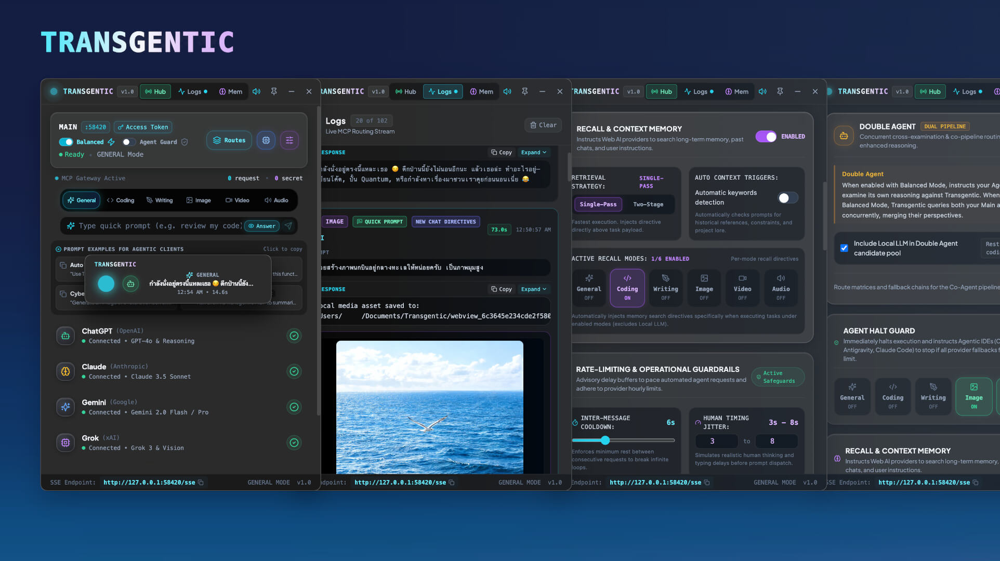

<h1 align="center">Transgentic</h1>

<p align="center">
  <strong>Local-First AI Orchestration Workspace, Completion Provider &amp; MCP Gateway</strong><br>
  <em>Connect AI clients to local LLMs, native CLI services, APIs, and user-authorized web workflows, with Recall to help carry planning context into implementation.</em>
</p>

<p align="center">
  
  
  
  
</p>

<p align="center">
  <strong><a href="https://github.com/entertheexit/transgentic/releases/latest">Download desktop app</a></strong> ·
  <strong><a href="https://github.com/entertheexit/transgentic/releases/latest/download/transgentic-sync.zip">Download Chrome extension (.zip)</a></strong>
</p>

<p align="center">
  <a href="#overview">Overview</a> ·
  <a href="#getting-started">Downloads &amp; quick start</a> ·
  <a href="#provider-and-mcp-endpoints">Endpoints</a> ·
  <a href="#features">Features</a> ·
  <a href="#response-behavior">Responses</a> ·
  <a href="#documentation-index">Reference</a> ·
  <a href="#security-and-limitations">Security</a> ·
  <a href="#license">License</a>
</p>

<p align="center">
  
</p>

<p align="center"><sub>Desktop interface shown for orientation; controls and provider availability can differ by build and configuration.</sub></p>

---

<a id="-overview"></a>

## Overview

Transgentic is an experimental, source-available Electron desktop application, OpenAI-compatible completion provider, and Model Context Protocol (MCP) gateway. It connects AI clients to local large language models (LLMs), configured APIs, installed native AI CLIs, and authorized web AI sessions. You can use it as the primary model behind a client such as Cline, as an MCP tool in an agentic IDE, from a script or application, or through the desktop's own Quick Prompt.

Its two main uses are carrying available planning context into a task through **Recall**, and routing work between configured **Webview, API, CLI, and Local LLM providers**. The desktop manages routes, sessions, request formatting, permissions, and returned media files. Recall asks a provider to consult context available to its session; it does not directly access the provider's internal memory store.

| Use it from | Configure where work goes | Receive |
| :--- | :--- | :--- |
| OpenAI-compatible clients such as Cline | General and Coding route settings across eligible API, CLI, and Local LLM services; Writing uses General | Chat completions and tool calls; the client owns project actions |
| Agentic IDEs and MCP clients | Local models, APIs, built-in CLI services, web adapters, or custom recipes | Model answers with caller-appropriate guidance |
| Scripts and custom applications | Per-mode Main and Co-Agent routes with configured fallbacks | Text, code, saved-media paths, and structured outcomes |
| Desktop Quick Prompt | The same provider and routing settings | In-app answers without IDE workflow reminders |

**Configurable routes:** `General` · `Coding` · `Image` · `Video` · `Music`

Writing remains a distinct backend mode for prose and long-form work. It has its own MCP endpoints, explicit mode value, completion model, writing guidance, and log identity, while provider routing and per-mode policies use the General configuration. For a novel project, files such as `novel.md`, chapter Markdown files, or structured story JSON remain caller-owned artifacts. An agentic client edits those files with its own tools while Transgentic handles the request as Writing through the General route.

The gateway runs locally; requests can still leave your machine through a configured web provider or remote model endpoint. Provider access, model capabilities, and output quality depend on your account and configuration.

<sub><strong>Badge details:</strong> <strong>MCP SDK v1.6+</strong> summarizes the declared SDK dependency range, not a protocol revision. <strong>58420</strong> is the default port. <strong>AES-256-GCM</strong> describes secret-value encryption in the vault implementation, not whole-database encryption or a security certification.</sub>

<a id="before-using-transgentic"></a>

> **Before connecting an account:** use only services and content you are authorized to use. Account access does not itself establish permission to automate a service. Review the applicable provider terms, [security limitations](#security-and-limitations), and [source-available license](LICENSE).

---

<a id="-getting-started"></a>

## Getting started

### 1. Download and start the desktop

**[Desktop releases and release notes](https://github.com/entertheexit/transgentic/releases/latest)** · **[Chrome extension ZIP](https://github.com/entertheexit/transgentic/releases/latest/download/transgentic-sync.zip)**

Choose the desktop package for your system. The following files belong to [release v1.0.1](https://github.com/entertheexit/transgentic/releases/tag/v1.0.1); use the latest-release link above to check for newer builds.

| Download | File | Use |
| :--- | :--- | :--- |
| **[macOS · Apple Silicon](https://github.com/entertheexit/transgentic/releases/download/v1.0.1/Transgentic-1.0.1-arm64.dmg)** | `.dmg` · ARM64 | Desktop app for Apple Silicon Macs |
| **[macOS · Intel](https://github.com/entertheexit/transgentic/releases/download/v1.0.1/Transgentic-1.0.1.dmg)** | `.dmg` · x64 | Desktop app for Intel Macs |
| **[Windows](https://github.com/entertheexit/transgentic/releases/download/v1.0.1/Transgentic.Setup.1.0.1.exe)** | `.exe` · x64 | Windows desktop installer |
| **[Linux](https://github.com/entertheexit/transgentic/releases/download/v1.0.1/Transgentic-1.0.1.AppImage)** | `.AppImage` · x64 | Linux desktop application |
| **[Chrome extension](https://github.com/entertheexit/transgentic/releases/download/v1.0.1/transgentic-sync.zip)** | `transgentic-sync.zip` | Session synchronization for web providers |

Open the desktop package and follow its installation or launch steps. The desktop build does not require Git, Node.js, npm, or a source checkout. It does not include a local model; configure one or connect a permitted web session in the next step.

**For web providers:** download and extract the Chrome extension ZIP from the same release as your desktop build. In Chrome, open `chrome://extensions`, enable **Developer mode**, choose **Load unpacked**, and select the extracted directory containing `manifest.json`. The extension is not needed for local-model-only use.

Downloads are supplied under [LICENSE](LICENSE). For source changes, custom builds, or contributor testing, use the separate [custom development and build guide](docs/DEVELOPMENT.md#source-setup).

### 2. Configure a provider

| Provider type | Configure it |
| :--- | :--- |
| **Webview** | Install Transgentic Sync, sign in to an account whose intended use and automation are permitted, then synchronize the active provider session. |
| **API** | Open **Settings → Providers → API → Manage**, add an OpenAI-compatible endpoint and credential, then enable the provider. |
| **CLI** | Install and sign in to a supported native CLI, then open **Settings → Providers → CLI**, check its installation, test its connection, and enable it. |
| **Local LLM** | Start Ollama, LM Studio, or a compatible server; enable Local LLM, set its URL, fetch its model list, and select a model. |

Chrome does not need to remain open after synchronization, but a provider can later require login or verification. Treat imported session data as sensitive account access.

Codex CLI, Claude Code CLI, Antigravity CLI, and Grok CLI are built-in service definitions; Transgentic discovers installed executables but does not install them. **Provider Mode** is the default and supplies completions from caller-provided context while forcing access to host projects, project editing, and commands off. **Agentic Mode** allows explicitly registered workspaces on the Transgentic host, with editing and commands controlled separately and disabled by default. See [CLI services](docs/CLI_SERVICES.md) for setup, permission boundaries, and compatibility details.

On the **Routes** page, choose the intended provider for each task mode and review its fallback order. Webview, API, CLI, and Local LLM services participate in the same routing system. For local-only requests, use a model endpoint on your machine and remove external providers from the applicable routes.

### 3. Send a first request

**In the desktop:** choose **Coding** in Quick Prompt and send:

> Write a JavaScript function square(n) that returns n * n. Return only the code.

**From an MCP client:** copy your access token from **Settings → MCP Client Security & Authentication**, then configure:

| Connection setting | Value |
| :--- | :--- |
| Transport | Streamable HTTP |
| Server URL | `http://127.0.0.1:58420/mcp` |
| HTTP header | `Authorization: Bearer YOUR_TOKEN` |
| Alternative transport | SSE at `http://127.0.0.1:58420/sse` |

Use the actual port shown in the app. Replace `YOUR_TOKEN` locally and do not commit it. For clients using a `mcpServers` JSON configuration with URL and header support:

```json
{
  "mcpServers": {
    "transgentic": {
      "url": "http://127.0.0.1:58420/mcp",
      "headers": {
        "Authorization": "Bearer YOUR_TOKEN"
      }
    }
  }
}
```

Client formats vary; use the endpoint and header above in your client's supported configuration. After tool discovery, ask the agent:

> Use Transgentic MCP in coding mode to write a JavaScript function square(n) that returns n * n.

For scripts and terminal-based workflows, see the [command-line request examples](docs/MCP_TOOLS.md#command-line-requests). They are optional; desktop and MCP use do not require a source checkout.

**As an OpenAI-compatible model provider:** use this when Cline or another client should own the project, tools, and conversation while Transgentic supplies the model:

| Connection setting | Value |
| :--- | :--- |
| Provider type | OpenAI Compatible |
| Base URL | `http://127.0.0.1:58420/v1` |
| API key | Your Transgentic access token |
| Model | `transgentic/coding` |

The stable route models are `transgentic/general`, `transgentic/writing`, and `transgentic/coding`. Writing retains its backend mode and prose guidance while using the General route configuration. Enabled API providers, enabled Local LLM, and enabled, connected CLI services in Provider Mode also appear as direct `transgentic/provider/<provider-id>` models in `GET /v1/models`. Webview services are excluded until their recipes can verify temporary-chat or equivalent memory isolation. See the [completion gateway guide](docs/COMPLETION_GATEWAY.md).

### 4. Check the result

Expect a model answer, not just a workflow reminder. Inspect the reported provider and result status; a failure, partial result, or handoff is different from a completed model response. Review generated code before running it.

For follow-up requests, reuse the connection, mode, response profile, and `thread_id`. Set `new_thread: true` when you want a fresh conversation. Additional endpoint and stdio examples are in the [connection guide](docs/CONNECTING.md).

---

## Provider and MCP endpoints

Choose the gateway surface according to which application owns the task:

| Client role | Use | Task ownership |
| :--- | :--- | :--- |
| Transgentic is the client's primary model provider | OpenAI-compatible `/v1` API | The client owns conversation history and executes its project tools locally. |
| An agent calls Transgentic as one tool among others | `/mcp` or `/sse` | The agent owns the surrounding task; Transgentic executes the selected route or service. |

Completion and MCP endpoints require the same Transgentic access token.

| Operation | Endpoint |
| :--- | :--- |
| List models | `GET http://127.0.0.1:58420/v1/models` |
| Chat completion | `POST http://127.0.0.1:58420/v1/chat/completions` |

Keep `/mcp` and `/sse` for clients that use Transgentic as an agentic tool.

Use **Streamable HTTP** when your client supports it, or **Server-Sent Events (SSE)** for clients using the legacy event-stream transport. Both reach the same local gateway and require authentication.

All URLs below use the default port. Send `Authorization: Bearer YOUR_TOKEN`; for clients without header support, append `?token=YOUR_TOKEN`. Keep tokens out of shared URLs and repository files.

### Unified gateway

Use this for mixed tasks and configured routing, including local models and custom providers.

| Routing | Streamable HTTP | SSE |
| :--- | :--- | :--- |
| Configured providers and modes | `http://127.0.0.1:58420/mcp` | `http://127.0.0.1:58420/sse` |

### Provider endpoints

Choose a provider-specific connection when the workflow calls for that service. Use `prompt_model` with the intended task mode; model availability still depends on the configured account and adapter.

| Provider | Streamable HTTP | SSE |
| :--- | :--- | :--- |
| ChatGPT | `http://127.0.0.1:58420/chatgpt/mcp` | `http://127.0.0.1:58420/chatgpt/sse` |
| Claude | `http://127.0.0.1:58420/claude/mcp` | `http://127.0.0.1:58420/claude/sse` |
| Gemini | `http://127.0.0.1:58420/gemini/mcp` | `http://127.0.0.1:58420/gemini/sse` |
| Grok | `http://127.0.0.1:58420/grok/mcp` | `http://127.0.0.1:58420/grok/sse` |

### Task-mode endpoints

Choose a mode-specific connection when an application consistently performs one kind of task. The mode supplies the routing context; it does not select a fixed provider.

| Task mode | Streamable HTTP | SSE |
| :--- | :--- | :--- |
| General | `http://127.0.0.1:58420/general/mcp` | `http://127.0.0.1:58420/general/sse` |
| Writing | `http://127.0.0.1:58420/writing/mcp` | `http://127.0.0.1:58420/writing/sse` |
| Coding | `http://127.0.0.1:58420/coding/mcp` | `http://127.0.0.1:58420/coding/sse` |
| Image | `http://127.0.0.1:58420/image/mcp` | `http://127.0.0.1:58420/image/sse` |
| Video | `http://127.0.0.1:58420/video/mcp` | `http://127.0.0.1:58420/video/sse` |
| Music | `http://127.0.0.1:58420/music/mcp` | `http://127.0.0.1:58420/music/sse` |

Writing is a first-class backend mode. `/writing/mcp`, `/writing/sse`, explicit `mode: "writing"`, and `transgentic/writing` preserve Writing guidance and request identity, while all provider selection and per-mode policy settings resolve through General.

Music covers songs, tracks, soundtracks, beats, melodies, jingles, BGM, and instrumentals. Narration, speech, voiceover, TTS, podcasts, and sound effects are reserved for a future Audio provider and are not advertised as a configurable route yet.

Endpoint choices supply routing context, not permission boundaries. Explicit tool choices or mode arguments can change the request's target or mode; keep them consistent. A media endpoint does not guarantee generation or a saved file.

For transport details, selection examples, and plain-client configuration, see [Connections and provider setup](docs/CONNECTING.md#http-and-sse-endpoints).

---

## Features

### Context and model coordination

- **Recall and context prompting:**

  Asks a configured web session to consult available memory, custom instructions, and conversation context. Includes per-mode controls and single-pass or two-stage prompting.

- **Local LLM integration:**

  Connects to configured model servers, including Ollama and LM Studio presets and compatible endpoints. Model selection and execution depend on the server you run.

- **Local Micro-task:**

  Can route recognized coding tasks—regexes, types, docstrings, test stubs, and standalone helpers—to an available local model, subject to route and session rules.

- **Local Compact:**

  Attempts to shorten eligible code or diff context with a configured model before web dispatch. Compaction can omit details and can be disabled.

- **Balanced Mode:**

  Adds mode-aware coordination guidance for agentic clients while retaining the model's answer. Guidance stays within the user's requested scope.

- **Double Agent:**

  Supports Main/Co-Agent comparison through concurrent provider requests, or Main output with IDE comparison guidance in Balanced Mode. One pipeline's failure can produce a partial result.

### Routing and everyday use

- **Per-mode routing:**

  Configure Main and Co-Agent providers, model choices, and fallback order across five task modes.

- **Quick Prompt and CLI providers:**

  Send requests from the desktop or bundled command-line bridge without requiring an agentic IDE. Built-in native CLI services can act as isolated completion providers or, with explicit host permissions, as Agentic Mode services.

- **MCP client profiles:**

  Agentic callers receive separate workflow reminders; plain callers receive neutral answers and errors. Applications can select the profile explicitly.

- **Conversation continuity:**

  Reuses scoped provider conversations and bounded local history. New-chat, expiry, and rollover rules determine when a conversation changes.

- **Preset prompt gating:**

  Applicable provider-side Recall and Balanced instructions are attached at a new chat or rollover rather than repeated on every turn.

- **Account profiles and background sessions:**

  Keeps web sessions in separate desktop partitions and uses the selected account for each provider. Login or verification may still require attention.

- **Custom webview recipes:**

  Configure selectors, model controls, and text or media extraction using JSON. Installation includes local notice and consent handling.

- **Local media delivery:**

  Attempts to save detected images, video, and music under the configured storage root, returning host file paths. Music files may use standard audio formats such as MP3 or WAV. The default root is `~/Documents/Transgentic`.

### Request controls and visibility

- **Account queues and duplicate matching:**

  Serializes shared webview access and matches eligible duplicate work within its execution scope.

- **Scoped cancellation and optional progress:**

  Keeps cancellation associated with its caller and request ID; compatible clients can request progress events.

- **Logs and structured outcomes:**

  Reports request state, actual providers, failures, partial answers, and saved artifacts where available.

- **Rate controls and Agent Halt Guard:**

  Provides local cooldowns, pacing, hourly limits, and agent-facing pause guidance. These do not override provider restrictions or control an IDE's permissions.

- **Selector repair and context rollover:**

  Attempts recovery when supported selectors or conversation limits change. Repairs and continuity summaries can fail or lose information.

- **Memory Hub and credential masking:**

  Replaces detected secret patterns with placeholders, restores matching values in responses, and cleans up request mappings. Vault secret values use AES-256-GCM; masking is not complete protection.

- **Local Zero-Leak option:**

  Adds a separate request-scoped masking layer. The feature name is not a promise of zero disclosure.

- **Authenticated local gateway:**

  Requires an access token for MCP and completion endpoints. It binds to loopback by default and can be explicitly shared on a selected local network interface. Companion synchronization endpoints have separate authentication boundaries.

- **Update checks:**

  Optionally checks GitHub at launch and hourly. Downloads and installation remain manual.

---

## Response behavior

| Caller or outcome | What to expect |
| :--- | :--- |
| Agentic client | Model answer first, followed by separate workflow guidance |
| Quick Prompt or plain client | Neutral model answer or error, without IDE reminders |
| Double Agent partial result | Available pipeline output plus failure attribution |
| No available route | Explicit handoff for agentic clients; configuration error for plain callers |
| Cancelled MCP request | No final result for that request; internal cancellation outcome remains available |

Recognized agentic clients select the agentic profile during initialization. Other initialized clients select plain. Legacy clients that skip initialization retain agentic responses unless overridden. Use `response_profile: "plain"` or `"agentic"` to choose explicitly.

Model responses include `content` and structured fields such as `status`, `answer`, `guidance`, `providers`, and `artifacts`. A `completed` status reports a returned result, not verified correctness. See [MCP responses](docs/MCP_RESPONSES.md) for the complete contract.

---

## Documentation index

| Topic | Contents |
| :--- | :--- |
| [Connections and provider setup](docs/CONNECTING.md) | Authentication, HTTP/SSE endpoints, stdio bridge, companion extension, connection checks |
| [OpenAI-compatible completion gateway](docs/COMPLETION_GATEWAY.md) | Cline setup, route models, tool ownership, Provider Mode, LAN access |
| [Built-in CLI services](docs/CLI_SERVICES.md) | Native CLI setup, Provider and Agentic modes, workspaces, permissions, compatibility |
| [MCP tools and application integration](docs/MCP_TOOLS.md) | Tool arguments, task modes, multi-turn examples, command-line requests |
| [MCP responses and caller profiles](docs/MCP_RESPONSES.md) | Agentic/plain responses, conversation isolation, outcomes, cancellation, progress |
| [Settings and routing](docs/CONFIGURATION.md) | Balanced Mode, Double Agent, Recall, local models, fallbacks, media, updates |
| [Custom webview recipes](docs/RECIPES.md) | Recipe fields, JSON examples, installation, consent, storage, selector repair |
| [Architecture and data handling](docs/ARCHITECTURE.md) | Request flow, session lifecycle, credential masking, storage boundaries |
| [Development and builds](docs/DEVELOPMENT.md) | Source setup, isolated tests, desktop packaging, documentation maintenance |
| [Publication guidance](docs/PUBLICATION.md) | Source hygiene, release review, third-party notices, publication checks |

The guides describe this source checkout. They are not a live provider compatibility list or confirmation that an installed release includes every documented change.

---

## Security and limitations

- **Gateway authentication:**

  MCP and completion endpoints require an access token and bind to loopback by default. LAN sharing must be enabled explicitly and exposes the authenticated gateway on the selected local interface. Browser-session and recipe synchronization use separate endpoints; they do not share the gateway authentication guarantee. Keep tokens and synchronized sessions private.

- **Provider communication:**

  There is no Transgentic-operated cloud relay. Prompts, attachments, and authenticated sessions communicate with the providers or model endpoints you configure. Local orchestration is not a guarantee that data stays on your machine.

- **Update checks:**

  When enabled, the app checks GitHub's public releases API at startup and hourly. The update-check request does not include prompts, session cookies, or account credentials. Updates are downloaded and installed manually.

- **Credential masking:**

  Pattern-based detection can miss secrets or mask non-secret text. Local encryption and request cleanup do not protect against every form of local access, logging, or disclosure. Do not rely on masking as the only control for private data.

- **Web adapters:**

  Selectors, login flows, model availability, media extraction, and rate-limit detection can change with a provider's interface. A recipe or repair attempt does not establish provider approval or guarantee continued operation.

- **Rate limits and recovery:**

  Cooldowns, queues, fallback rules, and recovery attempts are local controls. They are not a guarantee against account restrictions and are not intended to circumvent provider restrictions.

- **Generated output:**

  Review code before execution and review text and media before use. A completed request status means the request returned a result, not that the result is correct or suitable for your purpose.

The [publication check](docs/PUBLICATION.md#source-hygiene-and-build-checks) is a targeted source-hygiene check, not a legal review, security certification, or guarantee that every secret has been detected.

<a id="-legal--non-affiliation-disclaimer"></a>

## Legal and non-affiliation

**Transgentic is an independent, local-first developer productivity utility for workflow orchestration and context synchronization.**

- **Purpose & Memory Synchronization (Recall)**:

  Transgentic is designed to help developers synchronize memory, requirements, and contextual planning between their local agentic developer IDEs (e.g. Codex, Antigravity, Cursor, Claude Desktop) and their authorized web AI chat sessions (e.g. ChatGPT, Claude, Gemini, Grok). Recall asks configured sessions for available context; it does not guarantee access to earlier discussions or a provider's internal memory store.

- **Non-Affiliation**:

  Transgentic is an independent project and is not affiliated with, endorsed by, or sponsored by OpenAI, Anthropic, Google, xAI, or any third-party AI service provider. All product names, logos, trademarks, and registered trademarks are property of their respective owners.

- **Local Execution & Terms of Service**:

  Memory stores and the MCP bridge run locally, with no Transgentic-operated cloud relay. Prompts, attachments, and authenticated web sessions communicate with the providers you configure. Timing and rate guardrails are advisory local safeguards. Users retain full control and responsibility for their accounts, sessions, and compliance with the applicable terms of service and usage policies of each respective platform.

- **Session Continuity & Profile Recovery**:

  These features are not intended to circumvent any provider restrictions.

<a id="-support--sponsorship"></a>

## Project links

- [Repository](https://github.com/entertheexit/transgentic)
- [Issue tracker](https://github.com/entertheexit/transgentic/issues)
- Optional funding:

  [Buy Me a Coffee](https://buymeacoffee.com/patiparnne) · [Patreon](https://www.patreon.com/patiparnne)

<a id="-license"></a>

## License

Transgentic uses the custom [Transgentic Source-Available License 1.0](LICENSE):

- **Allowed without a license fee:**

  inspect, clone, build, modify, and use for personal or internal business purposes, including paid employment, freelance work, and client projects. You may sell independently created outputs that do not contain Transgentic code, subject to any separate rights in those outputs.

- **Sharing:**

  free, noncommercial source or binary redistribution and forks are allowed under the same license, with notices preserved and modifications identified.

- **Separate written permission required:**

  selling, renting, commercially redistributing, or bundling Transgentic or modified versions in a paid product, and offering its functionality to third parties as a hosted or managed service. Internal hosting is allowed.

This is source-available software, not OSI open source. The full license controls. Third-party components retain their own licenses and notices; licenses accompanying previously distributed versions are unaffected.
