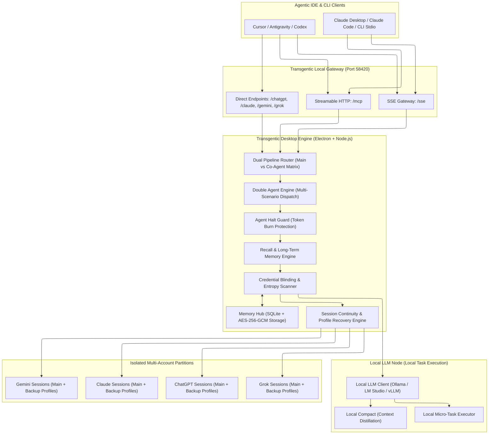
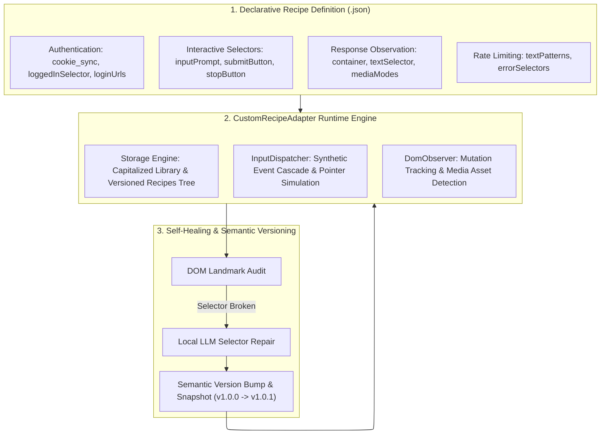
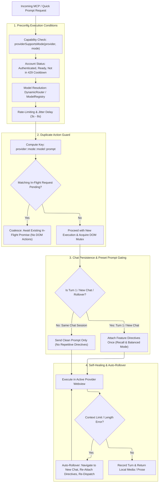
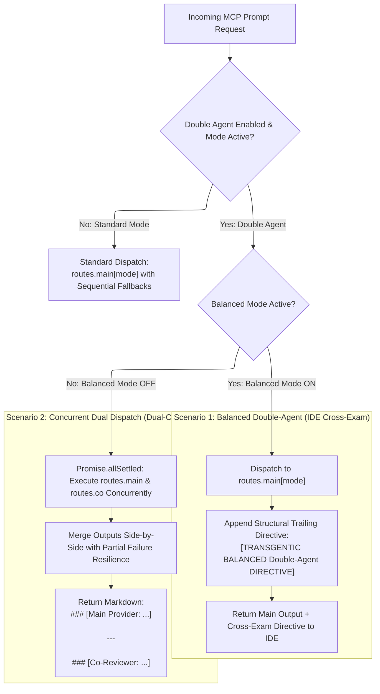
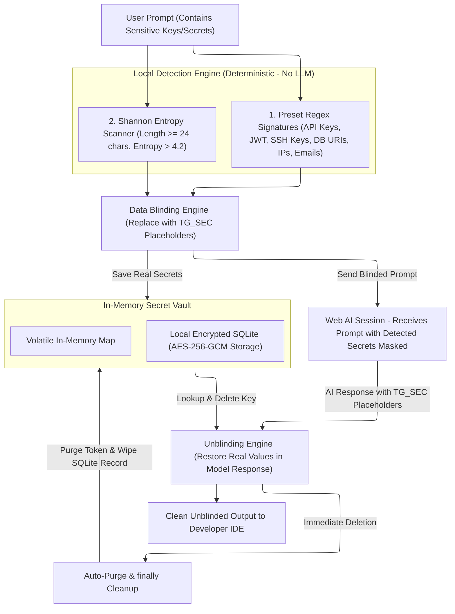

# Transgentic

<p align="center">
  <b>Local-First AI Orchestration Workspace & MCP Gateway</b>
  <br>
  <i>Connect agentic IDEs, local LLMs, and user-authorized provider workflows, with Recall to help carry planning context into implementation.</i>
</p>

<p align="center">
  <span style="background: rgba(6,182,212,0.15); color: #22d3ee; padding: 2px 8px; border-radius: 4px; border: 1px solid rgba(6,182,212,0.3); font-family: monospace; font-size: 11px;">MCP v1.6+</span>
  <span style="background: rgba(245,158,11,0.15); color: #fbbf24; padding: 2px 8px; border-radius: 4px; border: 1px solid rgba(245,158,11,0.3); font-family: monospace; font-size: 11px;">EXPERIMENTAL</span>
  <span style="background: rgba(16,185,129,0.15); color: #34d399; padding: 2px 8px; border-radius: 4px; border: 1px solid rgba(16,185,129,0.3); font-family: monospace; font-size: 11px;">PORT 58420</span>
  <span style="background: rgba(168,85,247,0.15); color: #c084fc; padding: 2px 8px; border-radius: 4px; border: 1px solid rgba(168,85,247,0.3); font-family: monospace; font-size: 11px;">AES-256-GCM</span>
</p>

<p align="center">
  <a href="https://buymeacoffee.com/patiparnne"></a>
  <a href="https://www.patreon.com/patiparnne"></a>
</p>

<p align="center">
  
</p>

---

## 📖 Overview

**Transgentic** is a source-available, local-first Electron desktop application and Model Context Protocol (MCP) gateway. It runs locally on your machine at `http://127.0.0.1:58420` (supporting both **SSE** and standard **Streamable HTTP `/mcp`** endpoints).

The planned public repository will contain reviewed application source, documentation, and releases under the [Transgentic Source-Available License](LICENSE), not an open-source license. Personal use and internal business use, including paid client work, are allowed without a license fee. Selling or commercially redistributing Transgentic, or offering it as a hosted or managed service to third parties, requires separate written permission. See [publication guidance](docs/PUBLICATION.md) for the release process; updating this license does not itself publish the repository.

### 🎯 The Core Mission: Bridging the Long-Term Memory Gap & Local LLM Synergy

1. **Solving the Agentic Memory Void (The Recall Engine)**:
   * **The Pain Point**: Developers frequently brainstorm, architect systems, write design plans, and establish project conventions inside their authenticated Web AI chat sessions (**ChatGPT, Claude, Gemini, Grok**). However, local agentic IDEs and CLI agents (**Codex, Antigravity, Cursor, Claude Code, Claude Desktop**) may not have access to that chat context, leaving developers to copy instructions or explain previously agreed decisions again.
   * **The Solution**: Transgentic bridges this divide via standard MCP protocols. Recall directives ask the configured Web AI session to consult available memory, custom instructions, and conversation context, helping agentic IDEs continue from earlier planning. Results depend on what the provider makes available to that session; Recall does not directly access a provider’s internal memory store.

2. **Coordinating Agentic IDEs with Local LLMs**:
   * **The Goal**: Let agentic IDEs use **Local LLMs** (Ollama, LM Studio, vLLM, Llama.cpp) for suitable tasks on user-controlled infrastructure.
   * **Balanced Micro-Task Offloading**: Routes eligible atomic coding micro-tasks (regex patterns, TypeScript types from JSON, docstrings, unit test stubs) to Local LLMs before invoking browser-based sessions, reducing latency and unnecessary provider usage according to the configured routing settings.
   * **Local Context Compaction (`Local Compact`)**: Local LLMs distill large codebase diffs and context blocks locally before dispatching to Web AI sessions.
   * **Local Zero-Leak Credential Blinding (`Local Zero-Leak`)**: Automatically masks sensitive API keys, database URIs, environment variables, and private IPs into ephemeral tokens before dispatch, safely unblinded in memory upon return.

> [!NOTE]
> **Authentication & Extension Setup**: Initial session authentication is imported via our lightweight companion Chrome extension, available through the in-app setup flow. Once synchronized, Transgentic operates standalone in isolated background partitions — Google Chrome does not need to remain open.
>
> Download the companion extension from the [Transgentic v1.0.1 release](https://github.com/entertheexit/transgentic/releases/download/v1.0.1/transgentic-sync.zip). Extract the ZIP, open `chrome://extensions`, enable **Developer mode**, choose **Load unpacked**, and select the extracted folder containing `manifest.json`.

### ✨ Key Capabilities

It equips your developer workflow with:
- **Automatic Update Check**: Enabled by default, with a saved checkbox in About to turn it off. Checks GitHub at launch and every hour for a newer stable release. Each newly detected version prompts once per app session, and the idle status circle alternates blue/red until you update. Clicking that indicator opens About, where an Update button replaces GitHub. Processing remains purple. Offline checks fail quietly; updates are downloaded and installed manually.
- **Recall & Context Memory Engine**: Asks the configured Web AI session to consult available memory, custom instructions, and conversation context to support agentic IDE planning.
- **Local LLM Micro-Task Engine & Context Distillation**: Integrates with Ollama, LM Studio, and vLLM for eligible micro-tasks, local context compaction, and responses from locally hosted models.
- **Double Agent & Dual Pipeline Dispatch**: Simultaneously query Main and Co-Agent pipelines or instruct your Agentic IDE to cross-examine its own reasoning against Transgentic.
- **Dual Pipeline Routing Matrix (Main vs. Co-Agent)**: Independent candidate routes and fallbacks across all 6 modes with automatic Mutual Exclusion guards.
- **Balanced Mode Harness**: Standardizes reasoning and coordinates task allocation between Agentic IDEs, Web AI services, and Local LLMs.
- **Agent Halt Guard**: Configurable per-mode circuit policy to immediately halt AI agents from burning context tokens when capacity limits, cooldowns, or fallback exhaustion occur.
- **Strict Chat Persistence & Preset Prompt Gating**: Keeps multi-turn conversations in the active chat view without unexpected resets. Feature preset directives (Recall and Balanced Mode) are attached once on Turn 1 (new chat), sending clean, uncluttered user prompts on all subsequent turns.
- **Duplicate Action Guard & In-Flight Coalescing**: Prevents multiple redundant chats, duplicate DOM actions, and AI service rate-limit issues by coalescing identical in-flight requests into a shared execution promise.
- **Self-Healing & Auto-Rollover**: Recovers transparently from provider context limit errors and DOM stalls without crashing agentic workflows.
- **Standalone Background Operation**: Operates independently with dedicated background partitions — no Google Chrome or external browser needs to remain open while working.
- **Authenticated Loopback Gateway**: Requires a cryptographic access token (`tg_live_...`) to protect local MCP endpoints from unauthorized access.
- **Atomic Concurrency-1 Queue**: Exactly-one-submit acknowledgement and isolated FIFO execution per account profile.
- **AES-256-GCM Encrypted Vault & Request-Scoped Blinding**: Replaces credentials (`sk-...`, SSH keys, IPs) with cryptographically random tokens with request cleanup handled in `finally` blocks.
- **Rate-Limiting & Operational Guardrails**: Built-in inter-message cooldowns, configurable pacing delays, and sliding hourly limits.
- **Local Disk Media Delivery**: Saves generated images, videos, and music files to local disk (`~/Documents/Transgentic`), returning clean file paths instead of bloated Base64 strings.
- **Local Orchestration**: The desktop gateway runs locally with isolated session partitions; requests are sent to the providers or local model endpoints you configure.

---

## 🏗️ Architecture



---

## 🔌 Connecting MCP Clients for Each AI Service

Transgentic provides both a **Unified Gateway** (which routes intelligently across models) and **Dedicated Direct Endpoints** for each individual AI provider.

> [!IMPORTANT]
> **MCP Client Authentication**: All MCP endpoints require authentication. Include your access token via query parameter `?token=YOUR_TOKEN` or HTTP header `Authorization: Bearer YOUR_TOKEN`. You can view or regenerate your token in the app under **Settings → MCP Client Security & Authentication**.

### 1. Unified Gateway Endpoints (All Services with Auto-Failover)
* **SSE Endpoint**: `http://127.0.0.1:58420/sse?token=YOUR_TOKEN`
* **Streamable HTTP MCP Endpoint**: `http://127.0.0.1:58420/mcp?token=YOUR_TOKEN`

---

### 2. Dedicated Endpoints for Each AI Service Provider

If you want your agent or IDE tool to bind **strictly to a specific AI provider**:

| AI Provider | SSE URL | Streamable HTTP URL | Target Models |
| :--- | :--- | :--- | :--- |
| **Claude (Anthropic)** | `http://127.0.0.1:58420/claude/sse?token=YOUR_TOKEN` | `http://127.0.0.1:58420/claude/mcp?token=YOUR_TOKEN` | Claude 3.5 Sonnet, Claude 3 Opus |
| **ChatGPT (OpenAI)** | `http://127.0.0.1:58420/chatgpt/sse?token=YOUR_TOKEN` | `http://127.0.0.1:58420/chatgpt/mcp?token=YOUR_TOKEN` | GPT-4o, o1, o3-mini, GPT-4 |
| **Gemini (Google)** | `http://127.0.0.1:58420/gemini/sse?token=YOUR_TOKEN` | `http://127.0.0.1:58420/gemini/mcp?token=YOUR_TOKEN` | Gemini 2.0 Flash, Gemini 1.5 Pro |
| **Grok (xAI)** | `http://127.0.0.1:58420/grok/sse?token=YOUR_TOKEN` | `http://127.0.0.1:58420/grok/mcp?token=YOUR_TOKEN` | Grok 3, Grok 2, Aurora Vision |

---

### 3. Dedicated Task Mode Gateways (Pre-Locked Modes for Media & IDEs)

If you want your agent, IDE tool, or custom application (such as a Storyboard generator) to lock **directly into a specific task mode**:

| Task Mode Gateway | SSE URL | Streamable HTTP URL | Target Workflows & Models |
| :--- | :--- | :--- | :--- |
| **Image & Storyboard** | `http://127.0.0.1:58420/image/sse?token=YOUR_TOKEN` | `http://127.0.0.1:58420/image/mcp?token=YOUR_TOKEN` | Image & Storyboard Generation (`gpt-image-2`, Grok Imagine, DALL-E) |
| **Video Generation** | `http://127.0.0.1:58420/video/sse?token=YOUR_TOKEN` | `http://127.0.0.1:58420/video/mcp?token=YOUR_TOKEN` | Video Generation (`custom-video-model`, Veo 3.1) |
| **Audio & Music** | `http://127.0.0.1:58420/audio/sse?token=YOUR_TOKEN` | `http://127.0.0.1:58420/audio/mcp?token=YOUR_TOKEN` | Audio & Music Generation (`lyria-3-pro`) |
| **Coding Mode** | `http://127.0.0.1:58420/coding/sse?token=YOUR_TOKEN` | `http://127.0.0.1:58420/coding/mcp?token=YOUR_TOKEN` | Coding Mode (`kimi-k2-7-code`, Claude Sonnet) |
| **Writing & Prose** | `http://127.0.0.1:58420/writing/sse?token=YOUR_TOKEN` | `http://127.0.0.1:58420/writing/mcp?token=YOUR_TOKEN` | Writing & Prose Mode |

---

### 4. Client Configuration Guides by Platform

#### A. OpenAI Codex & ChatGPT App / CLI
* **macOS / Linux Config Path**: `~/.codex/config.toml`
* **Windows Config Path**: `%USERPROFILE%\.codex\config.toml`

##### Method 1: Configuration via `~/.codex/config.toml` (Recommended)
```toml
[mcp_servers.transgentic]
url = "http://127.0.0.1:58420/mcp"
http_headers = { "Authorization" = "Bearer YOUR_TOKEN" }
enabled = true
```

##### Method 2: Configuration via ChatGPT / Codex UI (Settings → Plugins → MCPs)
* **URL**: `http://127.0.0.1:58420/mcp`
* **Bearer token env var**: *(Leave blank)*
* **Headers**: Click `+ Add header`:
  * **Key**: `Authorization`
  * **Value**: `Bearer YOUR_TOKEN`

> [!TIP]
> **Using the "Bearer token env var" field**:
> If you prefer using environment variables, set the field to `TRANSGENTIC_TOKEN` (or `MCP_BEARER_TOKEN`) and export it in your shell profile (`export TRANSGENTIC_TOKEN="tg_live_..."` in `~/.zshrc` or `~/.bashrc`).
> **Do not** paste the raw token string directly into the "Bearer token env var" input box, as ChatGPT/Codex expects the *variable name*, not the token value.

##### Method 3: Direct URL Token Parameter
* **URL**: `http://127.0.0.1:58420/mcp?token=YOUR_TOKEN`

##### Connecting Dedicated Direct Provider Endpoints in Codex:
```toml
[mcp_servers.transgentic_claude]
url = "http://127.0.0.1:58420/claude/mcp"
http_headers = { "Authorization" = "Bearer YOUR_TOKEN" }

[mcp_servers.transgentic_chatgpt]
url = "http://127.0.0.1:58420/chatgpt/mcp"
http_headers = { "Authorization" = "Bearer YOUR_TOKEN" }
```

---

#### B. Cursor IDE
* **Project Scope Config Path**: `.cursor/mcp.json` (at your project workspace root)
* **Global Scope Config Path**:
  * macOS: `~/Library/Application Support/Cursor/User/globalStorage/mcp.json`
  * Windows: `%APPDATA%\Cursor\User\globalStorage\mcp.json`

```json
{
  "mcpServers": {
    "transgentic": {
      "url": "http://127.0.0.1:58420/sse?token=YOUR_TOKEN"
    }
  }
}
```

Or configure via UI: **Cursor Settings → Features → MCP → Add New MCP Server** (`Type: SSE`, `URL: http://127.0.0.1:58420/sse?token=YOUR_TOKEN`).

---

#### C. Antigravity & Gemini Code Assist
* **macOS / Linux Config Path**: `~/.gemini/config/mcp_config.json`
* **Windows Config Path**: `%USERPROFILE%\.gemini\config\mcp_config.json`

```json
{
  "mcpServers": {
    "transgentic": {
      "command": "npx",
      "args": [
        "-y",
        "mcp-remote",
        "http://127.0.0.1:58420/sse?token=YOUR_TOKEN"
      ]
    }
  }
}
```

---

#### D. Claude Desktop
* **macOS Config Path**: `~/Library/Application Support/Claude/claude_desktop_config.json`
* **Windows Config Path**: `%APPDATA%\Claude\claude_desktop_config.json`

Claude Desktop connects through standard stdio bridging using `npx -y mcp-remote`:

```json
{
  "mcpServers": {
    "transgentic": {
      "command": "npx",
      "args": ["-y", "mcp-remote", "http://127.0.0.1:58420/sse?token=YOUR_TOKEN"]
    }
  }
}
```

---

#### E. Claude Code CLI
Run directly in your terminal:

```bash
claude mcp add transgentic "http://127.0.0.1:58420/sse?token=YOUR_TOKEN"
```

Or connect a dedicated service:
```bash
claude mcp add claude-web "http://127.0.0.1:58420/claude/sse?token=YOUR_TOKEN"
```

---

#### F. CLI Stdio Bridge & Command Configuration (For Standalone CLI Agents & Custom Apps)
For developer tools, scripts, or custom applications (such as Storyboard generators) that connect via `stdio` or run terminal commands directly:

```json
{
  "mcpServers": {
    "storyboard-generator": {
      "command": "transgentic-cli",
      "args": ["--mode", "image", "--provider", "grok"],
      "env": {
        "TRANSGENTIC_PORT": "58420",
        "TRANSGENTIC_TOKEN": "YOUR_TOKEN"
      }
    }
  }
}
```

---

#### G. Dedicated Task Mode Configuration via MCP Settings (e.g. Storyboard / Image Generation)
To connect an agentic client or IDE (Cursor, Codex, Antigravity, Claude Desktop) directly to a dedicated mode gateway like `/image/sse` using `npx -y mcp-remote`:

```json
{
  "mcpServers": {
    "transgentic-image": {
      "command": "npx",
      "args": [
        "-y",
        "mcp-remote",
        "http://127.0.0.1:58420/image/sse?token=YOUR_TOKEN"
      ]
    }
  }
}
```

---

## 🎨 MCP Architecture, Task Modes & Multi-Model Routing

### 1. Why Task Modes & Multi-Model Routing are Essential
Different AI platforms and specialized models excel at different tasks (reasoning, vision, image generation, video creation, audio, and coding):
* **Image generation**: Grok Imagine / Vision (`grok-2-vision`), ChatGPT DALL-E (`gpt-4o`), Gemini Imagen (`gemini-2-0-flash`)
* **Video generation**: Grok (`grok-3`), Gemini Video (`gemini-2-0-flash`)
* **Audio / Music**: Gemini Audio (`gemini-2-0-flash`)
* **Coding**: Claude (`claude-3-5-sonnet`), ChatGPT (`o3-mini`, `gpt-4o`), Gemini (`gemini-2-0-flash`), Grok (`grok-3`)
* **General Text**: Claude (`claude-3-5-sonnet`), ChatGPT (`gpt-4o`), Gemini (`gemini-2-0-flash`), Grok (`grok-3`)

If an image or storyboard prompt is dispatched under `general` mode without specifying `mode: "image"`, a general text model may attempt to output text rather than generating visual media. Transgentic uses the **task mode** to automatically route prompts to the appropriate provider and specialized model!

### 2. Transgentic MCP Tool Structuring
Transgentic organizes its MCP capabilities into 3 distinct tiers:

1. **Unified Auto-Routing (`prompt_model`)**:
   * Takes `prompt`, optional `mode` (`'image' | 'video' | 'audio' | 'coding' | 'writing' | 'general'`), and optional `provider` or `model`.
   * Automatically classifies prompt intent using multilingual and storyboard heuristics.
   * **Tip for Agents**: When creating images, videos, or storyboard scenes, set `mode: "image"` or call `generate_image` directly to request the appropriate media model from the active provider. Availability and switching support depend on the provider and recipe.

2. **Dedicated Media Tools (`generate_image`, `generate_video`, `generate_audio`, `generate_music`)**:
   * Pre-locks the mode (`image`, `video`, `audio`) so providers immediately invoke the proper generation engine (e.g. Grok Imagine or Gemini).
   * Accepts optional `provider` (`'grok'`, `'chatgpt'`, `'gemini'`) and `model`.
   * Automatically downloads generated media files locally to disk and returns a concise local path (e.g. `./assets/generated_image.png`), saving tokens.

3. **Direct Provider Gateways (`ask_chatgpt`, `ask_claude`, `ask_gemini`, `ask_grok`)**:
   * Directly routes to a specific service.
   * Includes an optional `mode` property in `inputSchema` so you can target a specific mode (e.g., `ask_grok` with `mode: "image"`).

---

### 3. Specifying a Mode in Command (For Custom Apps & Scripts)

If you created an app (such as a storyboard generator) that connects to Transgentic, you can specify the mode up-front in three convenient ways:

#### A. In MCP Server Configuration (`transgentic-cli --mode image`)
Pass `--mode image` (and optional `--provider grok`) in the launch arguments. Any MCP tool call through this connection automatically inherits `image` mode:
```bash
transgentic-cli --mode image --provider grok
```

#### B. Dedicated SSE & Streamable HTTP Mode Gateways
Connect directly to pre-configured mode gateways:
* `http://127.0.0.1:58420/image/sse` — Image & Storyboard Generation (`gpt-image-2`, Grok Imagine, DALL-E)
* `http://127.0.0.1:58420/video/sse` — Video Generation (`custom-video-model`, Veo 3.1)
* `http://127.0.0.1:58420/audio/sse` — Audio & Music Generation (`lyria-3-pro`)
* `http://127.0.0.1:58420/coding/sse` — Coding Mode (`kimi-k2-7-code`, Claude Sonnet)
* `http://127.0.0.1:58420/writing/sse` — Writing & Prose Mode
* Or via query parameters: `http://127.0.0.1:58420/sse?mode=image&token=YOUR_TOKEN`

*(All mode endpoints also support Streamable HTTP MCP at `http://127.0.0.1:58420/{mode}/mcp?token=YOUR_TOKEN`)*

#### C. Direct One-Shot Terminal Commands (No MCP Client Needed)
You can call Transgentic directly from Python scripts, shell scripts, or backend apps:
```bash
# Generate storyboard image via Grok:
transgentic-cli image "Storyboard Scene 1: Hero enters the abandoned temple at sunset" --provider grok

# Generate video:
transgentic-cli video "Dynamic aerial shot flying over a cyber city" --provider grok

# Direct prompt in coding mode:
transgentic-cli prompt "Write a Go REST server with SQLite" --mode coding

# Query system status:
transgentic-cli status
```

---

## 💻 Custom Application Integration SDK & Multi-Turn Thread Clients

Developers integrating Transgentic into custom apps, CLI bots, or agent frameworks can leverage stateful multi-turn threads using official MCP client SDKs in **TypeScript** and **Python**.

### Architecture & Session Continuity Highlights
* **Stateful Web Conversation Continuity**: Transgentic bridges stateless MCP tool calls into persistent, multi-turn AI web sessions. When your app supplies a `threadId`, Transgentic captures the resulting conversation URL from the provider's web session and re-navigates to that exact URL on subsequent turns (24-hour TTL).
* **Provider Isolation**: Sessions are stored as composite keys (`provider:threadId`). The same `threadId` can be used across multiple AI providers independently without collision.
* **Context Preservation**: All previous code snippets, system context, and artifacts in the conversation remain intact in the provider's web session, eliminating redundant re-prompting.

### 1. TypeScript Client Example (`@modelcontextprotocol/sdk`)

```typescript
import { Client } from '@modelcontextprotocol/sdk/client/index.js';
import { SSEClientTransport } from '@modelcontextprotocol/sdk/client/sse.js';

const transport = new SSEClientTransport(new URL('http://127.0.0.1:58420/sse?token=YOUR_TOKEN'));
const client = new Client({ name: 'my-custom-app', version: '1.0.0' }, { capabilities: {} });

await client.connect(transport);

// Turn 1: Initiate a persistent conversation thread
const turn1 = await client.callTool({
  name: 'prompt_model',
  arguments: {
    prompt: 'Implement a high performance debounce utility in TypeScript',
    mode: 'coding',
    model: 'claude-3-5-sonnet',
    threadId: 'feature-debounce-dev'
  }
});
console.log('Turn 1 Response:', turn1.content[0].text);

// Turn 2: Follow-up in the SAME thread (preserves all previous code & context)
const turn2 = await client.callTool({
  name: 'prompt_model',
  arguments: {
    prompt: 'Now add unit tests using vitest for the debounce function above',
    threadId: 'feature-debounce-dev'
  }
});
console.log('Turn 2 Response:', turn2.content[0].text);

// Turn 3: Start fresh when needed by passing newThread: true
const turn3 = await client.callTool({
  name: 'prompt_model',
  arguments: {
    prompt: 'Start fresh: Explain React concurrency model with diagrams',
    threadId: 'feature-debounce-dev',
    newThread: true
  }
});
console.log('Turn 3 Response:', turn3.content[0].text);
```

### 2. Python Client Example (`mcp` package)

```python
import asyncio
from mcp.client.session import ClientSession
from mcp.client.sse import sse_client

async def main():
    async with sse_client('http://127.0.0.1:58420/sse?token=YOUR_TOKEN') as (read, write):
        async with ClientSession(read, write) as session:
            await session.initialize()
            
            # Turn 1: Start conversation thread
            turn1 = await session.call_tool(
                'prompt_model',
                arguments={
                    'prompt': 'Draft a PostgreSQL schema for an e-commerce order system',
                    'mode': 'coding',
                    'model': 'gpt-4o',
                    'threadId': 'ecommerce-db-design'
                }
            )
            print("Turn 1:", turn1.content[0].text)

            # Turn 2: Continue in same thread
            turn2 = await session.call_tool(
                'prompt_model',
                arguments={
                    'prompt': 'Add indexing strategies and partition by order_date',
                    'threadId': 'ecommerce-db-design'
                }
            )
            print("Turn 2:", turn2.content[0].text)

asyncio.run(main())
```

---

## 📜 Custom Webview Recipes Engine (Declarative JSON Adapters & Self-Healing)

Transgentic introduces a **Declarative JSON Recipe Engine** for connecting **web AI chat interfaces, enterprise LLM portals, or creative media generators that you are authorized to use** as MCP providers without adding compiled adapter code. Any automated workflow must also comply with the provider's applicable terms and permissions; access to an account does not itself establish permission to automate it.

All built-in providers (`chatgpt`, `claude`, `gemini`, `grok`) and user-installed webview services run on this unified recipe specification.



---

### 1. How Custom Recipes Work

1. **Declarative DOM Landmarks**: Recipes define CSS selectors (or prioritized fallback candidate lists) for text input areas, send buttons, stop generation buttons, and model switchers.
2. **Multi-Mode Extraction**: The `response.modes` configuration defines extraction selectors for **Text/Markdown**, **Images** (``, `data:image/...`), **Videos** (`<video>`, `.mp4`), and **Audio/Music** (`<audio>`, `.mp3`), allowing Transgentic to download media assets directly to local disk.
3. **Cookie Synchronization (`cookie_sync`)**: Transgentic bridges session cookies from your active Google Chrome browser via the **Transgentic Sync** companion extension into an isolated background Electron partition (`persist:transgentic_<provider>`). Google Chrome does not need to stay open.
4. **Resilient URL Recovery (`resetUrlPatterns`)**: If a webview navigates away from the active chat view (e.g. into `/projects` or `/settings`), the recipe automatically redirects the session back to the clean chat interface.

---

### 2. Complete Recipe JSON Schema & Field Reference

| Top-Level Field | Type | Description |
| :--- | :--- | :--- |
| `id` | `string` (required) | Unique alphanumeric slug (e.g. `"custom_ai"`, `"deepseek"`, `"enterprise_portal"`). |
| `title` | `string` (required) | Human-readable provider name displayed across the UI (e.g. `"Enterprise AI Portal"`). |
| `version` | `string` (required) | Semantic version string (e.g. `"1.0.0"`). Automatically bumped by Self-Healing. |
| `domainMatch` | `string` (required) | Hostname pattern used by the Chrome extension to detect the site (e.g. `"chat.enterprise.ai"`). |
| `url` | `string` (optional) | Default entry URL loaded inside the background webview partition. |
| `newChatUrl` | `string` (optional) | Direct URL loaded when starting a brand new conversation turn (e.g. `"https://chat.enterprise.ai/new"`). |
| `resetUrlPatterns` | `Array<{ pattern, redirectTo }>` | Rules to redirect away from stranded pages (e.g. pattern: `"/settings"`, redirectTo: `"/new"`). |
| `selectors` | `object` (required) | Interactive DOM selector landmarks (see below). |
| `response` | `object` (required) | Output observation and media extraction schema (see below). |
| `authStrategy` | `"cookie_sync"` | Session authentication strategy. |
| `auth` | `object` (optional) | Verification cookies, logged-in badges, and login page redirect patterns. |
| `rateLimit` | `object` (optional) | Text patterns and error banner selectors indicating rate-limit cooldowns. |
| `models` | `Array<ModelDef>` (optional) | Models supported by the provider with declared modes (`general`, `coding`, `image`, `video`, `audio`). |

#### `selectors` Object Reference
* **`inputPrompt`** (*string | string[]*): CSS selector for the chat composer (e.g. `#prompt-textarea, div[contenteditable="true"]`).
* **`submitButton`** (*string | string[]*): CSS selector for the send/submit button.
* **`stopButton`** (*string | string[]*, optional): CSS selector for the cancel/stop generating button.
* **`modelDropdownTrigger`** (*string | string[]*, optional): Selector for opening the model switcher menu.

#### `response.modes` Object Reference
* **`text`**: `{ enabled: true, contentSelector?: "...", mediaKind: "text" }` — Prose and code extraction.
* **`image`**: `{ enabled: true, contentSelector: "img.generated-image, img[src*='storage']", downloadSelector?: "...", mediaKind: "image" }` — Image generation.
* **`video`**: `{ enabled: true, contentSelector: "video source, video[src]", downloadSelector?: "...", mediaKind: "video" }` — Video generation.
* **`audio`**: `{ enabled: true, contentSelector: "audio source, audio[src]", downloadSelector?: "...", mediaKind: "audio" }` — Audio/music generation.

---

### 3. Practical Recipe Examples

#### Example A: Standard Text & Coding Webview Recipe (`custom_ai.json`)
```json
{
  "id": "custom_ai",
  "title": "Custom Enterprise AI",
  "version": "1.0.0",
  "domainMatch": "chat.enterprise.ai",
  "url": "https://chat.enterprise.ai",
  "newChatUrl": "https://chat.enterprise.ai/new",
  "resetUrlPatterns": [
    { "pattern": "/settings", "redirectTo": "/new" },
    { "pattern": "/projects", "redirectTo": "/new" }
  ],
  "authStrategy": "cookie_sync",
  "auth": {
    "authCookies": ["session_token", "__Secure-auth-session"],
    "minCookieLength": 20,
    "loggedInSelector": "button[data-testid='user-profile'], img[alt*='Avatar' i]",
    "loggedOutSelector": "a[href*='/login'], button[data-testid='login-btn']",
    "loginUrls": ["/login", "/signin"]
  },
  "rateLimit": {
    "textPatterns": ["Rate limit reached", "Too many requests", "Please try again later"],
    "selector": "[data-testid='error-banner'], .alert-danger"
  },
  "selectors": {
    "inputPrompt": "#prompt-textarea, div.ProseMirror[contenteditable='true'], textarea",
    "submitButton": "button[data-testid='send-button'], button[aria-label*='Send' i], button[type='submit']",
    "stopButton": "button[data-testid='stop-button'], button[aria-label*='Stop' i]",
    "modelDropdownTrigger": "button[data-testid='model-selector']"
  },
  "response": {
    "container": "[data-role='assistant'], div[data-testid^='turn-']:not([data-role='user'])",
    "textSelector": ".markdown, .prose, [data-testid='message-text']",
    "actionButtons": "button[aria-label*='Copy' i], button[title*='Copy' i]",
    "generatingIndicator": ".animate-pulse, [data-is-streaming='true']",
    "excludeSelectors": ["details", ".thinking-accordion", "footer"],
    "modes": {
      "text": {
        "enabled": true,
        "contentSelector": ".markdown, .prose",
        "mediaKind": "text"
      }
    }
  },
  "models": [
    {
      "id": "enterprise-v2",
      "displayName": "Enterprise V2 (Reasoning)",
      "mode": "general",
      "modes": ["general", "coding", "writing"]
    }
  ]
}
```

#### Example B: Multi-Modal Creative Recipe (Text, Image & Video)
```json
{
  "id": "creative_studio",
  "title": "Creative Studio AI",
  "version": "1.0.0",
  "domainMatch": "studio.creativeai.io",
  "url": "https://studio.creativeai.io/create",
  "authStrategy": "cookie_sync",
  "selectors": {
    "inputPrompt": "textarea[placeholder*='Describe' i], div[contenteditable='true']",
    "submitButton": "button[aria-label*='Generate' i], button[type='submit']",
    "stopButton": "button[aria-label*='Cancel' i]"
  },
  "response": {
    "container": ".generation-card, .result-turn",
    "textSelector": ".prompt-output-text",
    "modes": {
      "text": { "enabled": true, "mediaKind": "text" },
      "image": {
        "enabled": true,
        "contentSelector": "img.generated-art, img[src*='cdn.creativeai.io']",
        "downloadSelector": "a[download][href*='.png']",
        "mediaKind": "image"
      },
      "video": {
        "enabled": true,
        "pageUrl": "/video",
        "contentSelector": "video source, video[src]",
        "downloadSelector": "a[download][href*='.mp4']",
        "mediaKind": "video"
      }
    }
  },
  "models": [
    { "id": "flux-pro", "displayName": "Flux Pro", "mode": "image" },
    { "id": "motion-v3", "displayName": "Motion V3", "mode": "video" }
  ]
}
```

---

### 4. How to Add and Synchronize Recipes

#### Method A: In-App via Settings (Recommended)
1. In Transgentic, navigate to **Settings $\rightarrow$ Providers $\rightarrow$ Manage Providers $\rightarrow$ Webview tab**.
2. Click **"+ Add Webview Provider"**.
3. **Paste JSON**, **Upload `.json` file**, or click **"Load Template"** to pre-fill a valid recipe blueprint.
4. Click **"Save & Register Recipe"**. Transgentic stores the recipe locally and initializes the session partition.
   The desktop first displays the recipe notice and asks for confirmation. Cancel leaves the recipe and session uninstalled. Enabling an existing custom recipe also requires confirmation.
5. Open Google Chrome, navigate to the target AI domain, and click **"Sync Active Session"** in the Transgentic Sync extension.

#### Method B: Visual Inspector via Chrome Extension
1. Open the target AI web portal in Google Chrome.
2. Open the **Transgentic Sync** extension and click **"Visual Inspector"** ().
3. Hover and click the composer input, send button, and response container. The extension highlights DOM landmarks and compiles a complete recipe JSON.
4. Click **"Export Recipe"** and install it directly into Transgentic.

---

### 5. Local Storage Hierarchy & Semantic Versioning

Custom model discovery and switching use the optional `modelSelection` object in the recipe. Supply `item` (model card selector), and optionally `trigger`, `name`, `idAttribute`, `tier`, `tabs`, `confirm`, `close`, and `scrollContainer`. These values are CSS selectors except `idAttribute`, which names an attribute on each card. The engine uses the recipe's `models` catalog when discovery is unavailable; without model controls, automatic model switching is unavailable. Site-specific catalogs and selectors belong in the relevant recipe.

Recipes may include `disclaimer` and `disclaimerVersion`. The desktop preserves and displays this text, then records the accepted text, version, and timestamp locally as `disclaimerAcceptance`. Imported acceptance records never replace desktop confirmation. The notice does not grant provider authorization.

All recipe definitions and generated media files are persisted locally in the user-configured storage path (default: `~/Documents/Transgentic`):

```
~/Documents/Transgentic/
├── Library/
│   ├── Images/     # Downloaded PNG/WebP images
│   ├── Videos/     # Downloaded MP4 videos
│   └── Audios/     # Downloaded MP3/WAV tracks
└── Recipes/
    ├── Custom/     # User-installed recipes (<id>.json)
    ├── Healed/     # Self-healed active selector overrides (<id>.json)
    └── History/    # Versioned historical snapshots (<id>.v<version>_<timestamp>.json)
```

- **Clean Relative Media Paths**: Generated media returned to MCP clients uses clean relative paths (e.g. `./Library/Images/chatgpt_image_174000.png`) rather than bloated Base64 strings.
- **Semantic Version Tracking**: Every self-healing repair automatically bumps the semantic patch version (e.g. `1.0.0` $\rightarrow$ `1.0.1`), archives a historical snapshot in `Recipes/History/`, and records an audit changelog.
- **One-Click Rollback**: Built-in providers and custom recipes can be rolled back to any previous version or reset to factory defaults via Settings.

---

### 6. Automated Self-Healing & Local LLM DOM Repairs

When an AI provider pushes a frontend update that changes DOM class names or attributes:

1. **DOM Landmark Watchdog**: Detects missing or non-responsive input composers, send buttons, or response containers.
2. **History Snapshot**: Archives the pre-repair recipe to `Recipes/History/<id>.v<version>_<timestamp>.json`.
3. **Local LLM DOM Repair**: Transgentic feeds the current live DOM tree to your configured Local LLM (Ollama, LM Studio) to identify the updated element selectors.
4. **Live Hot-Reload**: Writes the repaired recipe to `Recipes/Healed/<id>.json`, bumps the version (`1.0.1`), and reloads the active Electron webview adapter in memory without restarting the application!

---

## ⚙️ Settings & Configuration Guide

Transgentic provides granular developer settings in the **Settings** view (accessible by clicking the gear icon in the Hub):

### 1. Balanced Mode (Synced with Hub)
* **Master Switch**: Standardizes reasoning and coding workflows across active AI providers with optimal fallbacks.
* **Hub Synchronization**: The toggle in Settings is kept in instant bidirectional synchronization with the `Balanced Mode` toggle in the Radial Hub header.
* **Workflow Coordination**: Determines how Double Agent operates (IDE Cross-Examination vs. Concurrent Dual Dispatch) and regulates Local LLM micro-task promotion.

### 2. Double Agent & Dual Pipeline Routing
* **Standalone Control**: Configured in its own dedicated card in Settings with master toggle and candidate pool options.
* **Per-Mode Granular Toggles**: Select which task modes (`general`, `coding`, `writing`, `image`, `video`, `audio`) participate in Double Agent. Modes toggled OFF execute in standard single mode (or standard balanced mode if Balanced Mode is ON).
* **Direct Route Navigation**: Includes a `Co-Agent` link button that immediately opens the Routing page with the Co-Agent pipeline pre-selected.
* **Multi-Scenario Dispatching**:
  * **Scenario 1 (Double Agent ON + Balanced Mode ACTIVE)**: Transgentic dispatches requests to the **Main Agent** only and injects a trailing directive (`[TRANSGENTIC BALANCED Double-Agent DIRECTIVE]`) instructing your external **Agentic IDE** (Cursor, Codex, Antigravity, Claude Code) to cross-examine its own reasoning and internal plan against Transgentic's output. Co-Agent routes remain on **Standby**.
  * **Scenario 2 (Double Agent ON + Balanced Mode DISABLED)**: Transgentic executes **Dual Concurrent Dispatch** (`Dual-Consumption`), querying both the **Main Agent** and **Co-Agent** pipelines simultaneously. Merged side-by-side responses are delivered in Markdown (`### [Main Provider: ...] \n\n --- \n\n ### [Co-Reviewer: ...]`) with partial-failure resilience.
* **Candidate Pool Configuration**:
  * **Include Local LLM in Double Agent**: Optional toggle allowing local models (Ollama, LM Studio) to participate as candidate reviewers in text and coding tasks.
  * **Strict Media Protection**: Local LLM is automatically excluded from `image`, `video`, and `audio` modes to prevent unsupported dispatch attempts.

### 3. Agent Halt Guard (Limit Agent & Circuit Breaker)
* **Per-Mode Circuit Breaker**: Configurable individually across all 6 modes (`general`, `coding`, `writing`, `image`, `video`, `audio`).
* **Token Burn Protection**: If all primary and fallback providers in the routing chain fail or return rate limits (`429`), Transgentic immediately halts and issues a hard-stop directive instructing Agentic IDEs to pause execution rather than looping indefinitely.
* **Live Synchronization**: Synchronized in real-time between the Radial Hub badge and Settings.

### 4. Recall & Context Memory Engine (The Core Bridge)
The **Recall Engine** is the centerpiece of Transgentic, addressing the critical pain point where local agentic IDEs lack the rich conversational memory, design blueprints, and project rules formulated across Web AI chat sessions:
* **Master Switch**: Toggle whether Transgentic primes Web AI sessions to retrieve past decisions, custom instructions, and long-term account memory.
* **Retrieval Strategies**:
  * **Single-Pass (Default)**: Injects targeted memory retrieval directives directly above the prompt payload for minimal latency, commanding the model to reconcile context with existing architectural lore.
  * **Two-Stage Deep Retrieval**: Enforces a strict two-phase process for complex tasks:
    1. *Phase 1 (Memory Audit)*: Explicitly audits long-term account memory, custom instructions, and prior conversational lore for relevant entities, system architecture, file structures, and constraints.
    2. *Phase 2 (Execution)*: Implements the requested task strictly adhering to the retrieved historical context, resolving conflicts in favor of previously established user decisions.
* **Per-Mode Granular Toggles**: Recall can be independently enabled or disabled across each mode (`general`, `coding`, `writing`, `image`, `video`, `audio`) in Settings.
* **Preset Prompt Gating**: Directives are attached once on Turn 1 (new chat session), keeping multi-turn conversations clean and token-efficient.
* **Auto Context Triggers**: Scans prompts for historical reference keywords (e.g. project rules, past decisions, architecture lore) to dynamically activate deep context retrieval.

### 5. Rate-Limiting & Operational Guardrails
* **Inter-Message Cooldown** (Default: `6s`, Range: `2s - 15s`): Enforces a rest buffer between consecutive requests to limit repeated requests and avoid rapid dispatch loops.
* **Request Pacing** (Default: `3s - 8s`, Range: `1s - 30s`): Applies configurable randomized delays before prompt dispatch.
* **Sliding 1-Hour Rolling Limiter**: Automatically tracks requests over a rolling 60-minute window per partition against the configured local request limit.

### 6. Local Media File Storage
* **Disk Path** (Default: `~/Documents/Transgentic`): All generated images (`.png`), videos (`.mp4`), and music (`.mp3`) are downloaded directly to your local file system.
* **Zero Base64 in Context**: Prompts and MCP responses exchange concise local relative paths (e.g. `./assets/generated_image.png`) instead of massive megabyte-sized Base64 payloads, preserving LLM context tokens.

### 7. Custom MCP Port
* Change the local gateway port from `58420` to any port between `1024` and `65535` with instant server restart.

### 8. Models & Providers Management
* Enable or disable individual models for each provider (e.g. `gpt-4o`, `o1`, `claude-3-5-sonnet`, `gemini-2.0-flash`, `grok-3`).
* Configure selection modes: `Hybrid` (smart routing), `Default` (fixed model), or `Auto-Sync`.
* Dynamically resync active model selectors from the live web UI.

---

## 🎛️ Default Task Routing Matrix (Dual Pipeline: Main vs. Co-Agent)

Transgentic features independent **Dual Pipeline Routing**, allowing you to configure separate provider fallbacks for your **Main Agent** and **Co-Agent**:

### Main Agent Pipeline
| Task Mode | Primary Provider | 1st Fallback | 2nd Fallback | Capabilities & Preconfig Conditions | Output Handlers |
| :--- | :--- | :--- | :--- | :--- | :--- |
| **Coding** | Claude | ChatGPT | Gemini | Filtered to models with `coding` capability (`claude-3-5-sonnet`, `gpt-4o`, `gemini-2-0-flash`, `grok-3`) | Clean Code / JSON blocks |
| **Writing** | ChatGPT | Claude | Grok | Filtered to models with `writing` capability (`gpt-4o`, `claude-3-5-sonnet`, `grok-3`, `gemini-2-0-flash`) | Clean Prose / Markdown |
| **Image** | Grok | ChatGPT | Gemini | Filtered to image models (`grok-2-vision`, `gpt-4o`, `gemini-2-0-flash`). *Claude excluded (no image support)* | Local Disk File (`./assets/*.png`) |
| **Video** | Grok | Gemini | *None* | Filtered to video models (`grok-3`, `gemini-2-0-flash`). *Claude & ChatGPT excluded (no video support)* | Local Disk File (`./assets/*.mp4`) |
| **Audio** | Gemini | *None* | *None* | Filtered to audio/music models (`gemini-2-0-flash`). *Claude, ChatGPT & Grok excluded (no audio support)* | Local Disk File (`./assets/*.mp3`) |
| **General** | Claude | ChatGPT | Grok | Standard multi-turn models across all authenticated providers | Multi-Turn Conversation |

### Co-Agent Pipeline (Double Agent Secondary Reviewer)
| Task Mode | Default Primary | 1st Fallback | 2nd Fallback | Policy & Mutual Exclusion |
| :--- | :--- | :--- | :--- | :--- |
| **Coding** | ChatGPT | Claude | Grok | *Cannot duplicate Main primary (Claude)* |
| **Writing** | Claude | ChatGPT | Gemini | *Cannot duplicate Main primary (ChatGPT)* |
| **Image** | ChatGPT | Grok | Gemini | *Cannot duplicate Main primary (Grok)* |
| **Video** | Gemini | Grok | *None* | *Cannot duplicate Main primary (Grok)* |
| **Audio** | Gemini | *None* | *None* | *Cannot duplicate Main primary (Gemini)* |
| **General** | ChatGPT | Claude | Grok | *Cannot duplicate Main primary (Claude)* |

> [!IMPORTANT]
> **Mutual Exclusion Guard**: The Main Agent and Co-Agent pipelines use different primary providers for each task mode. Changing the Main Agent's primary selects an alternative provider for the Co-Agent, allowing comparison of responses from different models.

*Customize routing, fallback chains, and explicit models in the **Routing** page in the UI.*

---

## 🛡️ Preconfig Conditions, Session Lifecycle & Guardrails

Transgentic enforces deterministic preconfig checks, in-flight deduplication, strict multi-turn chat persistence, preset prompt gating, and automated self-healing across every request:



### 1. Preconfig Execution Conditions & Capability-Aware Routing
Before dispatching or typing any prompt into a provider's webview, Transgentic validates these deterministic preconfig rules:
- **Capability-Aware Provider Filtering**: The router queries `ServiceManifestManager.providerSupportsMode(providerId, mode)` against the model catalog. Providers without any models supporting the requested mode are automatically pruned from the candidate route chain (e.g. Claude is excluded from image/video/audio tasks; ChatGPT is excluded from video/audio tasks). In the Routes settings UI, unsupported providers are clearly marked with an `"Unsupported"` badge and disabled.
- **Provider & Account Health Check**: Verifies that the provider service toggle is enabled (`serviceEnabled: true`) and that the active account profile is logged in and not in a rate-limit (`429`) cooldown or error backoff.
- **Model Resolution**: Resolves the optimal target model via `DynamicRouter` (matching requested model overrides or configured defaults).
- **Concurrency & Rate Guardrails**: Checks configured sliding 1-hour request limits and applies randomized pacing delays (`3s - 8s`) before prompt entry.

### 2. Duplicate Action Guard (In-Flight Coalescing & Ban Prevention)
Accidental double-clicks or rapid agentic requests with identical prompts can trigger duplicate DOM actions, create redundant chats, and send unnecessary requests. Transgentic helps reduce duplicate submissions with the **Duplicate Action Guard**:
- **In-Flight Key**: Generates a deterministic key from `providerId::mode::model::normalizedPrompt`.
- **Request Coalescing**: If an identical request is already pending or actively executing on that provider, Transgentic **does not perform any new DOM actions, does not type into the input box, does not click submit, and does not create new chats**.
- **Shared Response Promise**: The duplicate request immediately latches onto the running execution promise and delivers the identical output (including local media paths) as soon as the first request completes.
- **Exclusive WebContents DOM Lock**: Every provider webview enforces `acquireDomLock()`, ensuring that navigation, prompt injection, and response extracting execute strictly with concurrency = 1.

### 3. Strict Chat Persistence & Session Lifecycle
Transgentic uses **Chat Persistence** to keep related requests in the active conversation:
- **Continuous Multi-Turn Context**: Prompts always stay inside the active chat conversation view, allowing the AI to build on prior code, design decisions, and context across multiple turns.
- **Zero Accidental Navigations**: Transgentic **never** calls `navigateToNewChat()` automatically unless:
  1. **Explicit User Request**: You click "New Chat" or "Clear Session" in the Quick Prompt / Hub UI.
  2. **Agentic Directive**: An MCP client explicitly passes `newThread: true` (or `new_thread: true`).
  3. **Turn / Length Rollover**: The session reaches the turn threshold (default 10 turns) or accumulated character volume threshold (default 30,000 chars) via `shouldRollover`.
  4. **Self-Healing Rollover**: The provider throws a context-limit exceeded error.
- **Session Scoping & TTL**: Thread sessions are keyed by `${effectiveThreadId}_${activeAccount.id}` with a 24-hour TTL and maintain a 20-turn sliding history for multi-turn Local LLM context and continuity summaries.

### 4. Preset Prompt Gating (Turn 1 / New Chat Only)
Transgentic features like **Recall** (historical context injection) and **Balanced Mode** (agentic coding harness) inject system directives:
- `[SYSTEM DIRECTIVE: RECALL & HISTORICAL CONTEXT]`
- `[SYSTEM DIRECTIVE: BALANCED AGENTIC HARNESS]`

Repeating these verbose instructions on every single turn causes token bloat, increases latency, and clutters conversation history. Transgentic applies **Preset Prompt Gating**:
- **Turn 1 (New Chat / Fresh Session)**: Directives are attached once along with the user prompt to prime the AI provider's conversational memory and harness.
- **Subsequent Turns (Same Chat)**: Transgentic sends **only the clean user prompt** (with data blinding applied if credentials are detected). System directives are omitted because the model is already primed.
- **Session Reset & Rollover**: Directives are re-attached only when a new chat session begins or upon an automatic rollover.
- **UI Visibility**: The **Logs** stream highlights Turn 1 requests with an indigo `NEW CHAT DIRECTIVES` badge, while subsequent turns in the same chat omit it.

### 5. Self-Healing & Auto-Rollover Engine
To prevent agentic workflows from crashing or stalling during long sessions:
- **Provider Context Length Self-Healing**: When a provider rejects a prompt with a context exhaustion error (e.g. `"conversation is getting too long"`, `"context_length_exceeded"`), Transgentic catches the error, automatically navigates to a new chat, wipes the expired session, re-attaches the preset directives once, and re-dispatches the prompt transparently.
- **DOM Watchdog & Stuck State Recovery**: Real-time DOM observers continuously monitor for frozen loaders or hanging generation spinners. When media or text finishes rendering, busy/generating flags are immediately cleared to prevent timeouts.
- **Account Status & Configured Provider Fallbacks**: Requests use the active account profile for each provider. Detected rate limits place the affected account in cooldown; requests requiring login or verification need user attention. Depending on the configured route, an unforced request may continue to another provider. These features are intended to support authorized workflows, not to circumvent provider rate limits, usage quotas, account restrictions, or other service limitations.

### 6. Balanced Mode: Web AI Services vs. Local LLM Micro-Tasks

**Balanced Mode** establishes an intelligent, asymmetric division of labor across your developer environment. It coordinates between your local agentic IDE (**Codex, Antigravity, Cursor**), web-based **Web AI Services** (Claude, ChatGPT, Gemini, Grok), and lightweight **Local LLMs** (Ollama, LM Studio, vLLM).

> [!NOTE]
> **Strict Route Dependence & User Settings**: Transgentic routing is governed entirely by the services you configure in **Routes** (the default primary provider and fallback chain for each task mode) and your **Local LLM Settings**:
> - If you configure **Local LLM as default** (e.g. for Coding mode), execution is 100% local — it has nothing to do with external web services.
> - If you configure **Web AI Services as default** with **Local LLM in the fallbacks chain**, the **"Local Micro-task"** setting in the Local LLM configuration modal controls micro-task promotion:
>   - **Turn 1 (New Chat Session)**: Requests always go directly to the configured Web AI Service to establish the session and attach cooperation directives.
>   - **After Turn 1 (Turn 2+)**: If **Local Micro-task** is **enabled**, Transgentic automatically detects micro-tasks and executes them via Local LLM (**Local Task Routing**). If disabled, Transgentic sticks strictly to what you set for the mode without checking Local LLM unless triggered by regular fallback.

```mermaid
---
config:
  layout: elk
---
flowchart TD
    Incoming["Incoming MCP Tool Request from Agentic IDEs / Clients (Codex, Antigravity, Cursor)"]
    ModeCheck{"Is Local LLM Active Provider at Runtime<br/>(Default or Triggered in Fallback Chain)?"}
    
    Incoming --> ModeCheck
    
    subgraph LocalFlow ["Local LLM Active Flow"]
        TurnCheckLocal{"Is Turn 1 / New Chat?"}
        DirectiveLocal["Tells Codex: Reason Locally & Only Use Transgentic MCP for Micro-Tasks<br/>(Includes command to continue task autonomously)"]
        LocalDirectExec["Execute Locally on Local LLM (Direct API / Fast Micro-Task)"]
        CleanRespLocal["Return Final Clean Response to Agentic IDE"]
    end
    
    subgraph WebAiFlow ["Web AI Services Flow (Claude, ChatGPT, etc.)"]
        TurnCheckWeb{"Is Turn 1 / New Chat?"}
        WebAiTurn1["Execute on Web AI + Attach Web AI Directive<br/>(Hard thinking & planning only; code edits local in workspace)"]
        MicroTaskCheck{"Local Micro-task Enabled in Modal<br/>& Local LLM in Fallback Chain<br/>& Request is Micro-Task?"}
        LocalTaskRoute["Local Task Routing:<br/>Execute Eligible Tasks on Local LLM"]
        WebAiTurnN["Execute on Configured Web AI Service via Webview"]
        CleanRespWeb["Return Final Clean Response to Agentic IDE"]
    end
    
    ModeCheck -->|YES: Local LLM Active| TurnCheckLocal
    TurnCheckLocal -->|YES: Turn 1| DirectiveLocal
    TurnCheckLocal -->|NO: Turn 2+| LocalDirectExec
    DirectiveLocal --> CleanRespLocal
    LocalDirectExec --> CleanRespLocal
    
    ModeCheck -->|NO: Web AI Active| TurnCheckWeb
    TurnCheckWeb -->|YES: Turn 1| WebAiTurn1
    TurnCheckWeb -->|NO: After Turn 1| MicroTaskCheck
    MicroTaskCheck -->|YES: Promote Local LLM| LocalTaskRoute
    MicroTaskCheck -->|NO: Keep Web AI / Disabled| WebAiTurnN
    WebAiTurn1 --> CleanRespWeb
    LocalTaskRoute --> CleanRespWeb
    WebAiTurnN --> CleanRespWeb
```



#### 🌐 Web AI Services in Balanced Mode (Avoid Spam, High-Level Reasoning)
When Web AI chat services (Claude 3.5 Sonnet, GPT-4o, Gemini 1.5 Pro, Grok 3) are active in Routes:
- **Avoid Spamming Webviews**: Continuous file-by-file edits, test runner logs, and minor syntax fixes risk triggering rate limits (`429`), captcha challenges, and session bans.
- **Division of Labor**:
  1. **Agentic IDE Role**: Heavy, continuous, and long execution tasks (code edits, large refactors, running unit tests, terminal commands, builds) are weighted directly on your local agentic client.
  2. **Transgentic MCP Role**: Strategic architectural planning, modular breakdowns, edge-case validation, creative storyboarding, and memory recall across web chat sessions.
  3. **Turn 1 Guidance**: Transgentic attaches `[TRANSGENTIC BALANCED HARNESS: WEB AI DIRECTIVE]` on Turn 1, instructing Codex to continue task implementation autonomously in its workspace. Subsequent turns return clean responses.

#### 💻 Local LLM in Balanced Mode (Micro-Tasks & Direct Endpoints)
When Local LLMs (Ollama, LM Studio, vLLM with models like Qwen 2.5 Coder, Llama 3, Mistral) are configured in Routes:
- **Opposite Dynamic**: Locally hosted models use your own hardware resources and may suit small, well-defined tasks. Planning and multi-file reasoning should be routed according to the capabilities of the configured models and the needs of the project.
- **Dedicated Micro-Task Specialization**: In Balanced Mode, Local LLMs are reserved exclusively for rapid, atomic coding micro-tasks:
  1. **Regex Construction & Explanations**: Crafting regular expressions, explaining pattern matching, and input validation.
  2. **TypeScript Types & Interfaces from JSON**: Inferring clean TypeScript types and interfaces from JSON schemas, mock responses, or payload objects.
  3. **Docstring & JSDoc Generation**: Generating comprehensive JSDocs, TSDocs, Python docstrings, and inline explanatory comments.
  4. **Simple Standalone Unit Test Stubs**: Scaffolding isolated test cases and stubs using Vitest, Jest, PyTest, or Mocha for individual functions.

#### ⚡ "Local Micro-task" Feature & Local Task Routing
In the **Local LLM Configuration Modal**, you can toggle the **"Local Micro-task"** feature:
- **Disabled (Default)**: Transgentic strictly adheres to the provider set for the mode. It will never check or divert requests to Local LLM at runtime unless triggered by a regular fallback failure from primary services.
- **Enabled**: When Balanced Mode is active and Local LLM is configured in the route fallback chain:
  - **Turn 1 (New Chat Session)**: Transgentic goes directly to the configured Web AI Service to establish the chat thread and set the cooperation guidelines.
  - **After Turn 1 (Turn 2+)**: Transgentic evaluates subsequent coding requests against deterministic regex signatures and lightweight local heuristic classifiers. If classified as a micro-task, Transgentic **routes the task to the configured Local LLM**, executing directly via `/v1/chat/completions` or `/api/generate`.
  - **Benefits**:
    - Reduces unnecessary browser-session requests and associated input latency.
    - Returns locally generated responses to the requesting agentic client.
    - If the task involves complex logic, system architecture, or deep reasoning, it stays on the primary Web AI service.

#### 🛡️ Local LLM Execution Guard (Coordination with Codex)
When Local LLM is set as the default provider, or is triggered in the fallback chain (e.g. when Web AI services are unavailable or cooling down) and Balanced Mode is enabled:
- **Micro-Tasks**: Local LLM executes them locally and immediately returns the clean code response.
- **Complex Architecture / Deep Reasoning**: Transgentic intercepts the request and responds to Codex with the directive:
  ```
  [TRANSGENTIC BALANCED HARNESS: LOCAL LLM MICRO-TASK DIRECTIVE]
  ```
  Telling Codex that Local LLM is reserved for micro-tasks, directing Codex to formulate and execute complex planning directly within Codex's own reasoning environment, and to only invoke Transgentic MCP (e.g. "use Transgentic MCP") for micro-tasks.

#### 📦 "Local Compact" Engine (Context Distillation)
When working with large codebases, feeding multi-file diffs and verbose files into web chat sessions quickly drains context limits and incurs high latency.
- **Automatic Threshold Trigger**: If the incoming prompt exceeds the character threshold (default: `4,000` characters), Transgentic automatically dispatches the prompt to your active Local LLM for context distillation.
- **Boilerplate Stripping**: The local model extracts essential type definitions, interface signatures, function headers, and core logic blocks while stripping dead comments, verbose imports, and repetitive boilerplate before dispatching to the target Cloud AI webview.

#### 🔒 "Local Zero-Leak" Engine (Ephemeral Credential Masking)
This feature helps reduce accidental credential exposure by masking detected patterns before dispatch:
- **Pre-Dispatch Masking**: Outbound prompts are scanned locally for sensitive API keys (`sk-...`, `ghp_...`, `AIza...`), database connection URIs (`postgres://`, `mongodb://`, etc.), environment variables, and private RFC 1918 IPv4 addresses (`10.x`, `172.16-31.x`, `192.168.x`).
- **Indexed Placeholders**: Secrets are replaced with indexed placeholders (`{{TRANSGENTIC_SECRET_KEY_n}}`) and mapped into an ephemeral in-memory vault tied to the request ID.
- **Automatic Unmasking**: When the AI response returns, Transgentic restores the original values from memory before handing the response back to your local IDE, followed by immediate memory purging.

### 7. Multi-Scenario Double Agent Dispatch Engine (`dispatchPipeline.ts`)

Transgentic's dispatch engine dynamically orchestrates execution across single-provider, IDE-assisted, and dual-concurrent modes:



1. **Scenario 1: Balanced Double-Agent (`doubleAgent.enabled && balancedMode`)**:
   - Queries `routes.main[mode]` via the primary provider (with fallback chain).
   - Injects a strict structural trailing directive instructing your external **Agentic IDE** (Antigravity, Cursor, Codex, Claude Code) to act as the second agent:
     ```markdown
     [TRANSGENTIC BALANCED Double-Agent DIRECTIVE]
     You are operating in Balanced Double-Agent mode.
     1. Compare and cross-examine the above output from Transgentic with your own internal reasoning, plan, or draft.
     2. Identify discrepancies, potential bugs, edge cases, blind spots, or alternative perspectives.
     3. Synthesize the best possible solution, or explain why you favor one approach over the other.
     4. Proceed with confidence or invoke Transgentic again if critical ambiguities remain.
     ```
   - Co-Agent routes remain on **Standby**, avoiding an additional provider request while enabling the IDE itself to act as the co-evaluator.

2. **Scenario 2: Concurrent Dual Dispatch (`doubleAgent.enabled && !balancedMode`)**:
   - Concurrently dispatches requests to both `routes.main[mode]` and `routes.co[mode]` using `Promise.allSettled`.
   - **Partial-Failure Resiliency**: If one pipeline encounters a rate limit or DOM error, the surviving pipeline's response is delivered alongside a clear provider notice rather than failing the whole request.
   - Outputs side-by-side Markdown comparison:
     ```markdown
     ### [Main Provider: Claude (claude-3-5-sonnet)]
     <Main agent perspective and solution>

     ---
     ### [Co-Reviewer: ChatGPT (gpt-4o)]
     <Co-agent perspective and solution>
     ```

3. **Per-Mode Granular Selection (`doubleAgent.modes[mode]`)**:
   - Double Agent participates only in modes explicitly enabled (`general`, `coding`, `writing`, `image`, `video`, `audio`).
   - If a mode is toggled OFF, requests for that mode seamlessly fall back to standard execution (Standard Balanced if Balanced Mode is ON, or Standard Single if Balanced Mode is OFF), preventing accidental token usage or multi-pipeline overhead in non-participating workflows.

4. **Standard Mode (`!doubleAgent.enabled` or Mode Toggled OFF)**:
   - Standard execution according to `routes.main[mode]` with sequential provider fallbacks, returning clean unadorned output.

---

## 🛠️ MCP Tools Reference

When connected, Transgentic exposes the following standardized tools to your AI agent:

### 1. `prompt_model` / `transgentic_prompt`
Executes prompts with automatic data blinding, multi-turn thread continuity, and failover chains.
* **`prompt`** (*string*, required): The user prompt or instruction.
* **`mode`** (*string*, optional): `'general' | 'coding' | 'writing' | 'image' | 'video' | 'audio'`.
* **`provider`** (*string*, optional): `'claude' | 'chatgpt' | 'gemini' | 'grok'`.
* **`model`** (*string*, optional): Preferred model (e.g. `'claude-3-5-sonnet'`, `'gpt-4o'`, `'grok-3'`).
* **`threadId`** (*string*, optional): Persistent conversation thread identifier (24h TTL).
* **`newThread`** (*boolean*, optional): Forces creation of a clean conversation turn.
* **`projectName`** (*string*, optional): Project namespace for context segregation.

### 2. Media Generation Tools
* **`generate_image`**: Dispatches image prompt, downloads `.png` asset to local disk, returns file path.
* **`generate_video`**: Dispatches video prompt, downloads `.mp4` asset to local disk, returns file path.
* **`generate_audio`**: Dispatches audio/music prompt, downloads `.mp3` asset to local disk, returns file path.

### 3. `get_status` / `transgentic_get_status`
Returns real-time health, login states, rate limits, and active account profiles for all providers.

---

## 🧠 Memory Hub ("Mem") & In-Memory Secret Vault

The **Mem** tab houses Transgentic's privacy-first data blinding and long-term memory engine.

### 🛡️ How the In-Memory Secret Vault & Data Blinding Works

The Secret Vault does **not use an AI or LLM** to detect sensitive data. Instead, it operates 100% locally and deterministically using a hybrid engine combining **Preset Regex Signatures** with a **Shannon Entropy Mathematical Scanner**:



#### 1. Dual Secret Detection Architecture
* **Preset Regex Signatures (Known Patterns)**:
  * **API Keys**: OpenAI (`sk-...`), Anthropic (`sk-ant-...`), Google/Gemini (`AIza...`), HuggingFace (`hf_...`), Stripe (`sk_live_...`, `rk_live_...`), Slack (`xox[baprs]-...`).
  * **Cloud & Source Control**: AWS Access Key IDs (`AKIA...`, `ASIA...`), GitHub Tokens (`ghp_...`, `github_pat_...`).
  * **Authentication & Keys**: Bearer tokens, JSON Web Tokens (`eyJ...`), and Private Key blocks (`-----BEGIN RSA/OPENSSH PRIVATE KEY-----`).
  * **Infrastructure**: Database connection URIs (`postgres://`, `mysql://`, `mongodb://`, `redis://`, etc.), IPv4 addresses, and email addresses.
* **Shannon Entropy Scanner (Unknown / Generic Secrets)**:
  * For unrecognized alphanumeric strings with length $\ge 24$ characters, the engine computes the Shannon Entropy ($H = -\sum P(x_i) \log_2 P(x_i)$).
  * Strings with entropy $> 4.2$ (characteristic of random hashes, encryption keys, and proprietary credentials) are automatically classified as `generic_secret` and blinded.

#### 2. Vault Lifecycle & Credential Masking
* **Pre-Flight Data Blinding**: All detected secrets are replaced with unique cryptographically random tokens (`[[TG_SEC_<hex>]]`) before prompts are typed or sent to web AI sessions. Masking applies to detected patterns; unrecognized sensitive content may remain in a prompt.
* **In-Memory & AES-256-GCM SQLite Storage**: Active token maps are maintained in volatile memory and backed up to an encrypted SQLite database (`transgentic_memory.db`) keyed by a machine-local key (`.transgentic_mem_key`).
* **Response Unblinding & Auto-Purge**: When AI responses return with `[[TG_SEC_...]]` tokens, the engine swaps them back to the original values and immediately deletes the tokens from the vault.
* **Request Cleanup**: `finally` blocks remove request-scoped token mappings after processing.
* **Manual Flush**: Developers can inspect active blinded tokens and execute an instant vault wipe at any time from the UI.

---

## 🚀 Getting Started

### Prerequisites
* **Node.js**: v20+ or v22+
* **npm**: v10+

### Installation & Development

These instructions apply to a source checkout obtained under [LICENSE](LICENSE). Until publication, repository access is still required. Run tests only in an isolated checkout without personal runtime data.

```bash
# 1. Open your source checkout (or isolated test copy)
cd /path/to/transgentic

# 2. Install dependencies
npm install

# 3. Run all unit & integration tests
npm test

# 4. Start in development mode (Vite HMR + Electron Watch)
npm run dev
```

### Building Desktop Installers & Binaries

Transgentic can be built for macOS, Windows, and Linux using `electron-builder`:

```bash
# Build for macOS (Universal / DMG / ZIP)
npm run build:mac

# Build specifically for macOS Apple Silicon (ARM64) or Intel (x64)
npm run build:mac:arm64
npm run build:mac:x64

# Build for Windows (NSIS .exe / ZIP)
npm run build:win

# Build for Linux (AppImage / DEB)
npm run build:linux

# Build all packages
npm run dist
```

---

## 🔒 Security, Guardrails & Disclosures

1. **Local MCP Gateway (`127.0.0.1`)**: MCP requests require bearer token authentication. Browser session and recipe synchronization use separate local endpoints; they do not share the MCP authentication guarantee.
2. **Zero Cloud Relays**: No intermediary servers, proxies, or analytics telemetry. When automatic update checks are enabled, the app contacts GitHub's public releases API at startup and every hour; this request does not include prompts, session cookies, or account credentials.
3. **Isolated Partitions**: Web sessions run in dedicated Chromium partition jars (`persist:transgentic_<provider>_<account_id>`).
4. **Rate Guardrails**: Detected quota and rate-limit messages stop the affected generation. Detection depends on the provider UI and recipe; these checks are not a guarantee against account restrictions.

## 📜 Legal & Non-Affiliation Disclaimer

**Transgentic is an independent, local-first developer productivity utility for workflow orchestration and context synchronization.**

- **Purpose & Memory Synchronization (Recall)**: Transgentic is designed to help developers synchronize memory, requirements, and contextual planning between their local agentic developer IDEs (e.g. Codex, Antigravity, Cursor, Claude Desktop) and their authorized web AI chat sessions (e.g. ChatGPT, Claude, Gemini, Grok). By providing local cross-tool memory recall, it prevents agentic tools from planning in isolation without awareness of discussions and designs formulated across other AI chats.
- **Non-Affiliation**: Transgentic is an independent project and is not affiliated with, endorsed by, or sponsored by OpenAI, Anthropic, Google, xAI, or any third-party AI service provider. All product names, logos, trademarks, and registered trademarks are property of their respective owners.
- **Local Execution & Terms of Service**: Memory stores and the MCP bridge run locally, with no Transgentic-operated cloud relay. Prompts, attachments, and authenticated web sessions communicate with the providers you configure. Timing and rate guardrails are advisory local safeguards. Users retain full control and responsibility for their accounts, sessions, and compliance with the applicable terms of service and usage policies of each respective platform.
- **Session Continuity & Profile Recovery**: These features are not intended to circumvent any provider restrictions.

---

## 💖 Support & Sponsorship

If you find Transgentic helpful for your local AI agent orchestration and development workflows, consider supporting the project:

- ☕ **Buy Me a Coffee**: [buymeacoffee.com/patiparnne](https://buymeacoffee.com/patiparnne)
- 🧡 **Patreon**: [patreon.com/patiparnne](https://www.patreon.com/patiparnne)

---

## 📄 License

Transgentic uses the custom [Transgentic Source-Available License 1.0](LICENSE):

- **Allowed without a license fee:** inspect, clone, build, modify, and use for personal or internal business purposes, including paid employment, freelance work, and client projects. You may sell independently created outputs that do not contain Transgentic code, subject to any separate rights in those outputs.
- **Sharing:** free, noncommercial source or binary redistribution and forks are allowed under the same license, with notices preserved and modifications identified.
- **Separate written permission required:** selling, renting, commercially redistributing, or bundling Transgentic or modified versions in a paid product, and offering its functionality to third parties as a hosted or managed service. Internal hosting is allowed.

This is source-available software, not OSI open source. The full license controls. Third-party components retain their own licenses and notices; licenses accompanying previously distributed versions are unaffected.
