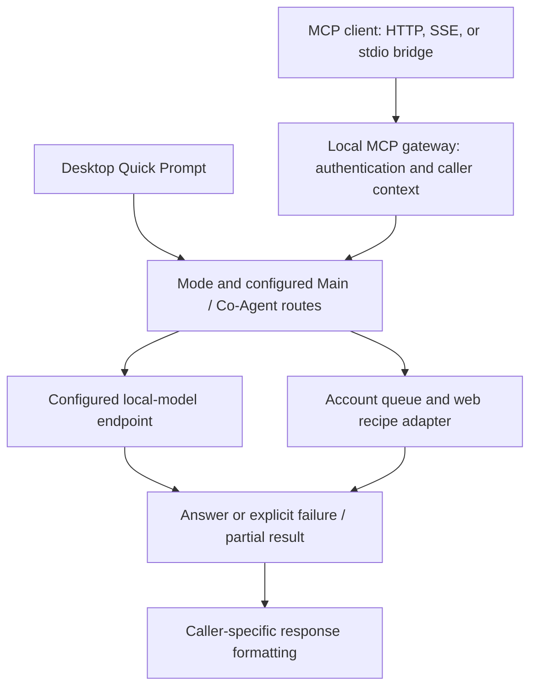

# Transgentic architecture and data handling

Technical overview of Transgentic request flow, conversation scope, credential masking, local storage, and network boundaries, with links to the relevant source files.

[Documentation index](../README.md#documentation-index)

## Contents

- [Request flow](#request-flow)
- [Conversations and concurrency](#conversations-and-concurrency)
- [Credential masking and Memory Hub](#credential-masking-and-memory-hub)
- [Storage and network boundaries](#storage-and-network-boundaries)
- [Source map](#source-map)

## Request flow

The desktop hosts the MCP server and provider sessions. Quick Prompt enters the same orchestration layer with a separate caller scope.

This is a conceptual flow, not a claim that every request uses both provider paths. Explicit provider selection, mode support, user settings, account state, cancellation, and errors affect execution.

For successful model requests, formatting retains the provider answer. Workflow guidance is added for agentic callers, not substituted for missing output. See [the response contract](MCP_RESPONSES.md).

## Conversations and concurrency

Conversation keys include the caller connection, response profile, mode, and thread/project identifier, with account/provider and pipeline scoping added during execution. Session records track provider chat URLs and bounded history.

A new scope starts a fresh provider chat. An existing scope may resume its recorded URL. Resets, expiry, rollover, provider errors, or an app restart can affect continuity; the local session map is not a durable archive of provider conversations.

Quick Prompt's New Chat clears its own desktop conversation records and defers navigation until its next queued request. It does not reset another MCP client's conversations.

Web execution uses account queues and DOM locks to serialize access to a shared provider view. Duplicate matching includes execution scope and preserves prompt case and whitespace. Different accounts, conversations, and independently cancellable requests do not share an execution promise.

Cancellation is scoped to a connection and request ID. Stopping local processing does not prove that a provider has undone a request it already received.

## Credential masking and Memory Hub

The Memory Hub's blinding engine detects patterns with regular expressions and an entropy heuristic; it does not use an LLM for that detection. Recognized patterns include some API tokens, private keys, database URIs, IP addresses, and email addresses. High-entropy strings may also be classified as secrets.

Detected values are replaced with random `[[TG_SEC_...]]` placeholders. The vault keeps token mappings for response restoration and uses request cleanup to remove mappings after processing. The Memory Hub also exposes inspection and manual flush controls.

The storage implementation uses AES-256-GCM for secret values stored in SQLite, with a machine-local key. This is not whole-database encryption; other fields and metadata can remain readable. Runtime support matters: availability of the database backend should be checked in the running build rather than inferred from the presence of code.

The separate optional Local Zero-Leak layer uses `{{TRANSGENTIC_SECRET_KEY_n}}` placeholders for its detected patterns. See [Local model options](CONFIGURATION.md#local-model-options).

Neither system proves that a prompt contains no sensitive information. False negatives and false positives are possible. Restored output may contain the original sensitive values; treat it accordingly. Clearing a vault does not erase information already sent elsewhere or copies in other stores.

## Storage and network boundaries

- Web sessions run in dedicated Electron/Chromium partitions. Session data can confer account access and should remain private.
- Conversation state, logs, recipes, media, and the secret vault are distinct stores with different lifetimes. “Local” does not mean “not retained.”
- Media and recipe storage use the configured root; see [the recipe storage layout](RECIPES.md#storage-and-versioning).
- Requests go to configured web providers and model endpoints. The endpoint URL, not the “Local LLM” label alone, determines whether model traffic stays on the host.
- Enabled update checks contact GitHub. The MCP server, companion synchronization endpoints, and provider connections have different authentication boundaries.
- Returned media paths refer to the Transgentic host; a remote client needs its own authorized means of accessing those files.

Read the [README security limitations](../README.md#security-and-limitations) before relying on these mechanisms.

## Source map

| Area | Source |
| :--- | :--- |
| MCP routing and response assembly | [server.ts](../src/main/mcp/server.ts) |
| Caller profiles | [clientContext.ts](../src/main/mcp/clientContext.ts) |
| Structured results | [responseEnvelope.ts](../src/main/mcp/responseEnvelope.ts) |
| Double Agent | [dispatchPipeline.ts](../src/main/mcp/dispatchPipeline.ts) |
| Conversation state | [threadManager.ts](../src/main/registry/threadManager.ts) |
| Recipe lifecycle | [recipeManager.ts](../src/main/registry/recipeManager.ts) |
| Local context compaction | [localCompact.ts](../src/main/localllm/localCompact.ts) |
| Optional credential masking | [localZeroLeak.ts](../src/main/localllm/localZeroLeak.ts) |
| Memory database | [memoryDb.ts](../src/main/storage/memoryDb.ts) |
