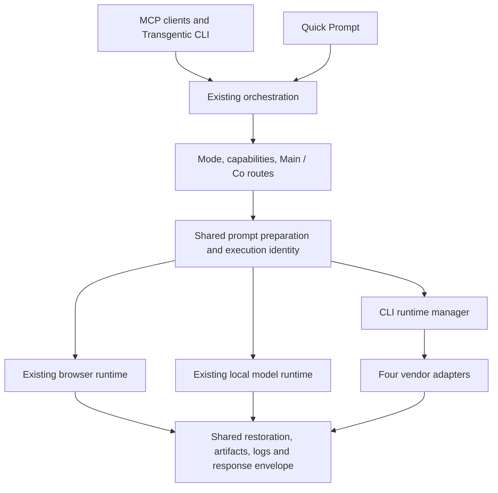

# Built-in CLI services: implementation plan

Implementation status and verified compatibility are recorded in [CLI_SERVICES.md](CLI_SERVICES.md). This document retains the original target plan; not every release gate below is qualified. Codex currently uses structured exec rather than App Server because native configuration loading and nested sandbox behavior require an externally confined execution path.

Status: proposed; no application implementation included. Prepared 2026-09-10 against source revision `c11d66e` and current vendor documentation.

## Objective and scope

Add four first-class CLI services alongside the existing web services and local model connection: Codex CLI, Claude Code CLI, Google Antigravity CLI, and xAI Grok Build CLI. All four participate in the same Transgentic request flows, with capabilities determining which features are available.

“Built-in” means Transgentic ships the service definitions, adapters, setup UI, and compatibility checks. The initial release discovers user-installed vendor executables and uses their supported authentication. It does not automatically install or redistribute vendor binaries. Existing provider selections and routes remain unchanged until the user configures a CLI service.

Confirmed launch scope: answers, planning, code generation, project editing and command execution. Provide independent **Allow project editing** and **Allow commands** controls, both **off by default**. Selecting a service, coding mode or an agentic response profile does not enable either permission. `coding` is a task category, not filesystem authorization.

## Evidence from the current repository

| Existing boundary | Integration consequence |
| --- | --- |
| `src/main/mcp/server.ts`: `orchestratePrompt` is shared by MCP and Quick Prompt; `executePipelineCandidateChain` branches into Local LLM or browser execution. | Add CLI dispatch inside this shared orchestration boundary. Do not build a second gateway. |
| `src/shared/types.ts`: `providerType` supports `api` and `webview`; service/status/account types require browser URLs or partitions. | Introduce a CLI discriminator and transport-specific fields without requiring fake browser state. |
| `src/main/registry/serviceManifest.ts`: defaults and persistence filters identify recognized built-ins; `modelRegistry.ts` seeds entries from the manifest. | Add all four to the baseline and persistence logic; preserve user settings and discovery state. |
| `src/main/mcp/router.ts`: mode support, Main/Co routes, model choices, emergency candidates, local promotion, limits and circuit state. | CLI eligibility must include installation, authentication, runtime capabilities, and requested execution policy. |
| `src/main/registry/accountRegistry.ts`: `getActiveAccount` can create and persist a browser profile. The server calls it before execution selection, too. | Replace these assumptions with transport-aware execution identities throughout orchestration, not just inside the new CLI branch. |
| `src/main/registry/threadManager.ts`: in-memory, 24-hour session map; browser URL field, bounded history, preset markers and rollover. | Add opaque CLI session references while retaining caller/profile/mode/pipeline isolation and existing session lifetime. |
| `src/main/index.ts`: status aggregation, service enablement, model resync, account actions, and shutdown call browser managers. | Dispatch lifecycle and settings actions by service type. CLI enablement must not invoke recipe consent or create web contents. |
| `src/renderer/components/RoutesSettings.tsx`, `RadialHub.tsx`, `SettingsView.tsx`, and `src/renderer/App.tsx` contain provider lists and API/browser branches. | Generalize lists and actions so all four built-ins appear correctly across the UI. |
| `src/main/mcp/handlers/codingHandler.ts` and `recallHandler.ts` contain web/local-specific guidance. | Introduce CLI-specific context and guidance; preserve answer-first and plain/agentic behavior. |
| `src/main/mcp/server.ts` tool schemas and `bin/transgentic-cli.js` help name four web providers. | Extend the public contract without changing the meaning of existing direct tools. |

The router can broaden an empty eligible chain to enabled services, while `orchestratePrompt` explicitly constrains forced-provider calls. CLI readiness and opt-in checks must apply to emergency candidates as well as normal routes. Do not inadvertently make installing a CLI change where prompts are sent.

## Four built-in integrations

| Service ID | Display name / executable | Recommended integration |
| --- | --- | --- |
| `cli_codex` | Codex CLI / `codex` | App Server over child-process stdio, with explicit thread and turn IDs. |
| `cli_claude_code` | Claude Code CLI / `claude` | Print mode with structured streaming output and explicit session resume. |
| `cli_antigravity` | Antigravity CLI / `agy` | Structured print mode; enable streaming stdin only when the installed version supports it. |
| `cli_grok` | Grok CLI (Grok Build) / `grok` | ACP over child-process stdio, with explicit session ownership. |

These IDs are distinct from `chatgpt`, `claude`, `gemini`, and `grok`. Browser subscriptions, cookies, models, and conversation URLs are not reused as CLI credentials or session identifiers.

Codex App Server documents initialization, thread start/resume, turn execution/interruption, and model discovery. It fits a desktop host with ongoing conversations. Keep `codex exec --json` as a smaller compatibility option only if its resume/cancellation contract passes the same tests; never switch protocols during an active request. [OpenAI App Server](https://learn.chatgpt.com/docs/app-server), [non-interactive execution](https://learn.chatgpt.com/docs/non-interactive-mode).

Claude Code provides non-interactive `-p`, structured output, and `--resume` with a session ID. Use its result event for completion and distinguish assistant content from diagnostics and tool events. Tool availability and MCP restrictions must be configured explicitly for the selected execution policy. [Programmatic execution](https://code.claude.com/docs/en/headless), [CLI reference](https://code.claude.com/docs/en/cli-reference).

Antigravity documents `agy`, `--output-format stream-json`, `--conversation`, and newer streaming-input support. Its output format differs from Claude’s despite similar flags. Headless permission denials may accompany a successful process exit, and workspace writes are permitted by default; neither exit zero nor print mode establishes answer-only operation. [Headless mode](https://antigravity.google/docs/cli/headless/), [permissions](https://antigravity.google/docs/cli/permissions/).

Grok Build documents `grok agent stdio` for ACP and `-p` with `--output-format streaming-json` for headless execution. ACP delivers assistant text through session updates, separately from prompt completion metadata. Prefer ACP to support session and permission interactions; retain headless mode only as a verified compatibility path. [Grok Build](https://docs.x.ai/build/overview), [headless and ACP integration](https://docs.x.ai/build/cli/headless-scripting).

Local inspection found `codex` 0.142.5 and `agy` on this shell’s PATH. The installed `agy --help` does not advertise the newer streaming-input option. `claude` and `grok` were not found on that PATH; this is not proof they are absent from other installation locations. No model prompts or authentication flows were run.

## Shared architecture

Add `src/main/providers/` for a narrow runtime interface and runtime registry. Wrap existing browser/local execution incrementally; preserve their behavior through characterization tests before moving code. Avoid a wholesale rewrite of the large server file.

The interface should expose `getCapabilities`, `getStatus`, `resolveIdentity`, `listModels`, `execute`, `cancel`, and `dispose`. Execution takes the prepared prompt, mode/model, caller-owned conversation key, Main/Co role, execution policy, progress callback and abort signal. It returns normalized text, actual model when known, session reference, usage when reported, artifacts and terminal outcome.

Add `src/main/cli/` for executable discovery, process ownership, protocol framing, CLI profile metadata, policy enforcement, and vendor adapters. Protocol details stay here rather than leaking into routing, React components, or MCP tools.

Separate capabilities from live state. Capabilities include supported modes, model selection/discovery, session resume, streaming, supported input/artifact types, and permitted execution policies. State includes missing executable, incompatible version, authentication required, ready, busy, cooling down, and error. Persist preferences; probe availability. An installed executable is not automatically authenticated or usable.

Use structured references such as `{ kind: 'cli', sessionId, profileId, runtimeFingerprint }` alongside legacy browser/local session records. Keep opaque native IDs in the main process. Persisting native session identifiers does not authorize another MCP connection to adopt those sessions.

## Feature alignment contract

| Existing flow or feature | Required CLI behavior |
| --- | --- |
| General, Writing, and Coding | All four support these backend text modes after compatibility checks. Writing keeps its identity and guidance while using the General route configuration. Use actual runtime/model availability. |
| Image, video, music | Preserve existing media routes. CLI services are ineligible until an adapter proves generation and saved-artifact support. Image input is a separate capability from image generation. |
| Main routes and fallbacks | CLI may be primary or fallback after explicit setup. Forced CLI requests stay on that CLI and report unavailable/unsupported states clearly. |
| Model selection | Preserve service toggles, user-enabled models, per-mode defaults/fallback models, and MCP override settings. Replace browser `lock_active_session` handling with the CLI session’s model policy. |
| Model discovery | Use supported metadata/list operations. Otherwise offer CLI default and user-configured model IDs marked unverified. Never mark a static web model list as discovered CLI availability. Report actual model only when supplied by the runtime. |
| Double Agent | Support CLI/web/local combinations under the existing Balanced Mode dispatch matrix. Separate Main and Co native sessions and identities. Preserve partial results and actual provider attribution. |
| Balanced Mode | Preserve the external caller’s ownership of implementation by default. CLI guidance identifies the CLI and its allowed role; do not label it a web service. |
| Plain / agentic profiles | Plain and Quick Prompt remain neutral. Agentic guidance remains a separate trailing block; provider answers remain first. Never feed the caller’s trailing routing reminder back into the child CLI. |
| Local Micro-task | Remains a Local LLM optimization. CLI services do not inherit local-only treatment simply because the executable runs on the host. Update first-turn detection to use the runtime identity. |
| Local Compact | Apply the existing eligibility/settings to cloud-bound CLI prompts through shared preparation; preserve original input on failure. Compaction is not enabled simply by selecting a CLI. |
| Blinding, Zero-Leak, Memory Hub | Preserve masking/restoration and request cleanup. Use pipeline-scoped mappings where concurrent preparation could collide. Child diagnostics must not bypass redaction. Files independently read by an agent are outside prompt masking. |
| Recall | Use this scoped conversation’s retained history and permitted CLI context. Do not promise access to the vendor’s web-chat memory. Apply presets only on new sessions/rollovers as today. |
| Threads, new chat, project grouping | Preserve connection/profile/mode/thread/provider/identity/pipeline scope. Never use “most recent session” flags. `project_name` remains grouping, not a filesystem path. |
| Rollover / context exhaustion | Start a new native session with bounded available continuity; mark rollover honestly. Do not claim the old native session was archived unless an archive action occurred. |
| Duplicate protection / queues | Reuse scope-aware deduplication and serialize each CLI identity initially. Independently cancellable requests cannot share execution. Same-native-session turns are always serialized. |
| Rate limits / circuit breaker | Register dynamic CLI IDs and retain configured pacing. Separate browser interaction jitter from request limits. Parse real usage-cap signals; do not interpret auth failures or cancellation as quota exhaustion. |
| Progress / cancellation / Halt Guard | Map CLI events to existing progress stages without sending prompt/answer contents through MCP progress. Abort queued work, cancel only the owner’s native turn, suppress cancelled results, and never fallback after cancellation. Preserve plain/agentic error differences. |
| Logs and structured results | Preserve `content`, `metadata`, `isError`, and `structuredContent`. Add optional runtime kind/version, usage and safe diagnostic codes. Missing usage is unknown, not zero. |
| Hub / settings / routing UI | Include all four in service lists, provider themes, Main/Co controls, status, logs, and conflict handling. Open CLI setup/activity rather than a browser drawer. |
| Accounts and authentication | Use CLI-owned login and supported profiles. Disable unsupported multi-account controls; never simulate account isolation with browser partitions or swapping global token files. |
| Recipe / cookie / DOM flows | Stay browser-only, including model scraping, consent, healing, partition recovery, and Chrome extension sync. CLI equivalents are executable/auth/protocol diagnostics. |
| Reset / disable / shutdown | Cancel owned work and dispose owned processes. Clear Transgentic-owned mappings/temp files without deleting external CLI credentials or unrelated native sessions. |

## Process, session and permission design

Launch only a locally configured built-in adapter and verified executable. Resolve absolute paths from a desktop-safe discovery list and an optional file picker; recheck when path/version changes. macOS GUI PATH differences and Windows executable/package-manager wrappers need explicit handling. Do not execute login-shell startup files for discovery. Prefer native executables or a verified interpreter/script invocation over shell command construction.

Use argument arrays and `shell: false`. Send prompts through stdio where supported. If a compatible print-only version requires a prompt argument, pass only the prepared, masked prompt and document process-list visibility and argument-size limits. Unsupported long input should fail clearly rather than truncate. MCP callers cannot supply executables, raw flags, arbitrary environment values, or host paths.

Use bounded UTF-8/NDJSON framing, maximum event sizes, stderr limits, startup/idle/total deadlines, backpressure, and exactly-once terminal settlement. Track queued, starting, running, cancelling, and terminal states per request. Cancellation first uses the protocol, then terminates the owned process tree after a grace period. Do not kill a shared process carrying unrelated work; use separate processes or drain other turns before escalation. Clean up on app quit, service disable, and abandoned startup.

Pin each conversation to provider, CLI profile, runtime configuration and execution policy. Account/config changes must invalidate or explicitly rebind the mapping, never silently resume under another identity. Preserve the current in-memory ownership boundary on restart; persistent native sessions remain inaccessible to new callers unless a future explicit adoption flow authorizes them.

For answer-only operation, use a Transgentic-owned working directory and tested tool/permission restrictions. Disable inherited MCP servers, hooks, plugins and automatic instructions where the supported runtime allows it. A temporary directory, read-only flag, or plan prompt alone does not establish isolation; verify the permitted reads, writes, commands and network tools for each supported version. Where the required policy cannot be enforced, report incompatibility rather than quietly allowing broader execution.

Prevent recursive dispatch at two levels: exclude Transgentic from child MCP configuration and do not expose the gateway credential to the child; add gateway enforcement for any deliberately issued child identity so it cannot recursively invoke model-routing tools. Test with a native CLI installation that already has Transgentic configured. Environment markers alone are not access control.

Use native sign-in with bounded setup state and a clear recheck action. Native credentials remain CLI-owned; store only profile references and sanitized auth status. Auth detection should not generate model traffic on every health poll. Use cached diagnostics and explicit connection tests; do not inherit the browser’s eight-second polling loop for process startup.

Normalize errors into missing executable, incompatible version, authentication required, unavailable model, permission required, rate limited, context exhausted, timeout, cancelled, protocol failure and runtime failure. Retry/fallback only when the operation is safe to repeat and provider selection permits it. Partial output plus a crash is not successful completion. Permission soft-denials must not become a claim that a requested action succeeded.

## Project execution and permission controls

Ship project execution in the initial release with a locally registered workspace ID and execution policy independently of `mode` and `response_profile`. Existing MCP requests default to answer-only. A selected workspace may grant bounded read access or editing/commands; remote callers receive only capabilities previously granted locally, and cannot select arbitrary host directories.

Store `allowProjectEditing: false` and `allowCommands: false` as separate defaults for each CLI service, with workspace-specific grants. Service settings define a ceiling; workspace and caller grants can narrow it. A request can narrow permissions further but cannot elevate them. New workspaces and migrated installations start with both grants off. Reuse existing grants without repeatedly requesting approval for operations already within them.

| Allow project editing | Allow commands | Effective behavior in the selected workspace |
| --- | --- | --- |
| Off | Off | Answers and permitted read-only project inspection; no file changes or commands. |
| On | Off | File changes through supported edit tools; command tools, hooks and indirect shell execution remain disabled. |
| Off | On | Commands under enforced filesystem restrictions that prevent project modification; commands requiring writes fail clearly. |
| On | On | Editing and commands within the registered workspace and configured permission scope. |

Read access requires selection of a registered workspace; with none selected, run against only the supplied prompt and Transgentic-owned context. CLI-managed authentication/session bookkeeping uses separate runtime storage. Command permission does not implicitly grant arbitrary external application actions or expanded filesystem access.

Enforce permissions at the tool/protocol boundary and the filesystem/process boundary. Disabling an Edit tool alone cannot enforce “no project editing” if shell, scripts, patches or hooks can still write. Verify restrictions on every supported OS/runtime combination; visibly disable a policy combination that cannot be enforced instead of pretending to support it. Configuration changes take effect before new dispatch; revoking a permission stops affected active work and queued work is revalidated.

Require a runtime that supports the selected restrictions and a usable permission interaction. For structured interactive protocols, surface requests outside the existing grant through scoped desktop UI; unattended print adapters return a permission-required result when they cannot proceed. Already granted operations execute without repeated prompts where the native protocol supports that. Never auto-answer terminal prompts by scraping a TUI.

For Double Agent project work, use one authorized writer and a reviewer with read access, or independent workspaces. Do not let two pipelines edit the same checkout concurrently. Once a run may have changed files or executed commands, do not automatically replay it on another provider. Report partial/unknown completion with available evidence. Cancellation does not roll back prior edits.

Expose changed files, command outcomes and verified saved artifacts in activity/results. Imported artifact paths must stay within registered roots, reject traversal/symlink escapes, and be validated before entering the existing asset/preview flow. Prompt masking cannot cover arbitrary repository or tool output automatically; document that boundary in this execution mode.

## User-facing flow and public interfaces

Settings → CLI Services displays the four built-ins with installation state, detected version, authentication, model, **Allow project editing**, **Allow commands**, and Test Connection. Both permission switches start off. Setup offers official installation guidance, executable selection, native sign-in, and model discovery where supported. Enablement makes the service available in Routing; it does not reorder existing routes. The hub shows CLI status and opens an activity/setup panel with stop and retry actions. Quick Prompt can select a registered workspace and displays the effective permissions before dispatch.

Extend `prompt_model.provider` with the four CLI IDs. Add `ask_codex_cli`, `ask_claude_code_cli`, `ask_antigravity_cli`, and `ask_grok_cli` for parity with built-in direct services. Existing `ask_claude` and `ask_grok` continue to mean web services. Update direct HTTP dispatch and validation wherever those tools are mirrored, and preserve HTTP/SSE/stdio bridge behavior.

Keep current argument aliases and plain/agentic schemas. Add optional `workspace_id` and request-level editing/command restrictions to CLI-capable prompt tools; resolve them against local grants and reject unknown/ungranted workspace IDs. Their absence preserves existing answer-only requests. The existing `transgentic-cli` remains a client of the running gateway; update its help, validation, and result rendering to accept the new providers and workspace selection. `get_status` and desktop status IPC aggregate runtime status, rather than sourcing everything from `globalSessionManager`.

Update both `src/main/preload/mainPreload.ts` and the shipped `mainPreload.cjs`; packaging currently copies the CJS file. Add narrowly validated IPC methods for CLI discovery, settings, authentication setup, model discovery, connection test and activity. Never expose a generic child-process IPC endpoint.

## Implementation sequence and acceptance gates

| Phase | Deliverable | Exit condition |
| --- | --- | --- |
| 1. Runtime contracts and migration | Transport-aware definitions, identities, capabilities and session references; four built-ins; preserved defaults. Characterize current orchestration before extracting shared preparation/finalization. | Existing routes/config/account/thread fixtures load identically. CLI entries survive save/restart and never create browser partitions. |
| 2. CLI foundation | Discovery, compatibility records, owned-process manager, framing, cancellation, diagnostics, auth/profile references and permission policy. | Fake executables cover fragmented Unicode, oversized/malformed events, early exit, hangs, child processes, cancelled queues and startup failures. |
| 3. Four vendor adapters | Codex App Server, Claude structured print, Antigravity version-aware print, Grok ACP. One conformance suite with adapter-specific fixtures. | Each supports an answer, explicit model/default, a second turn, fresh conversation, error, cancellation and permitted project work. Record exact versions, OS and permission combinations. |
| 4. Orchestration parity | Shared CLI dispatch; Main/Co routing; model/identity selection; Recall; masking/compaction; limits; response guidance; status/log aggregation; public MCP tools. | Mixed-provider matrix preserves forced routing, local promotion, caller isolation, partial results and progress contracts. No recursive child dispatch. |
| 5. Desktop and packaging | CLI setup/activity, hub/routing changes, workspace selection, independent default-off permission controls, both preloads, disable/reset/shutdown and documentation. | Verify rendered UI and actual packaged executable discovery on supported platforms, including missing CLI, expired login and grant/revocation behavior. |
| 6. End-to-end qualification | Isolated regression suite and opt-in live tests across all four; project-execution permission matrix; release compatibility table and migration/rollback rehearsal. | All four are functional built-ins on their declared supported environments. Project work ships at launch; unsupported policy combinations are visibly unavailable. |

Proposed new modules: `src/main/providers/{providerRuntime,runtimeRegistry}.ts`; `src/main/cli/{cliRuntimeManager,executableDiscovery,processRunner,protocolFraming,cliProfiles,executionPolicy}.ts`; `src/main/cli/adapters/{codex,claudeCode,antigravity,grok}.ts`; renderer `CliServicesSettings.tsx` and `CliActivityPanel.tsx`. Names may be consolidated during implementation; responsibilities and boundaries should remain.

Focused regression coverage should extend `serviceManifest`, `modelRegistry`, `dynamicRouter`, `routeMatrixLocalLlm`, `responseGuidance`, `mcpCallerTransport`, `conversationScope`, `threadManager`, `sessionContinuityAndRollover`, `doubleAgent`, `duplicateActionGuard`, `accountQueue`, `localLlmMicroTask`, `localCompact`, `localZeroLeak`, `agentHaltGuard`, and `modeSelectionAndCli` tests. Test negative side effects as well as returned text: CLI dispatch must not call browser navigation, DOM locks, recipe consent, cookie sync or browser model scraping.

Live qualification uses harmless prompts and temporary workspaces: first/second turn, separate callers with identical thread IDs, Quick Prompt New Chat, model mismatch, cancellation during generation, service disable, restart, CLI/web and CLI/local Double Agent, and permission-denied behavior. Validate only declared media capabilities; do not treat text describing an image as an artifact.

For each adapter, test all four editing/command combinations, including file writes attempted indirectly through commands, hooks and subprocesses. Assert both default switches are off after first install and migration. Test workspace path escape, a remote caller attempting to elevate permissions, permission revocation during an active request, Double Agent writer/reviewer separation, and a failed command after an edit without automatic fallback replay. Supported project execution is not complete until these behaviors have live evidence on the declared target platforms.

Run tests in an isolated checkout with temporary data roots, per `docs/DEVELOPMENT.md`; this checkout contains personal runtime stores. Run the normal build and publication checks after implementation. No tests/builds or live prompts were required to produce this plan.

Rollback disables the new services and stops their owned processes while retaining prior routes/configuration for recovery. Version migrations must be additive and backed up; a downgrade must not delete native credentials or external sessions. No commit, publication, or deployment is part of this planning task.

## Decisions to settle during implementation

1. Establish the minimum supported binary versions and OS matrix from actual conformance runs, particularly Antigravity’s stdin and policy controls. Do not infer these from current documentation alone.
2. Confirm supported native profile/config isolation per vendor. Where no supported profile mechanism exists, expose one active native identity rather than promising multi-account support.
3. Verify Grok ACP completion/cancellation ordering and each adapter’s terminal-event semantics with captured versioned fixtures; do not use a fixed quiet-time delay as proof of completion.
