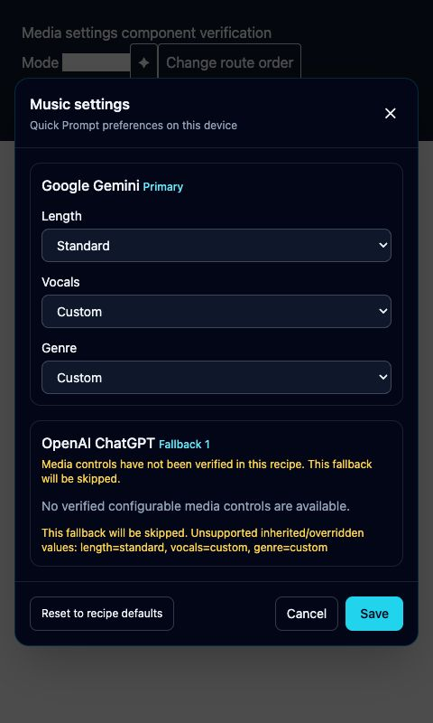
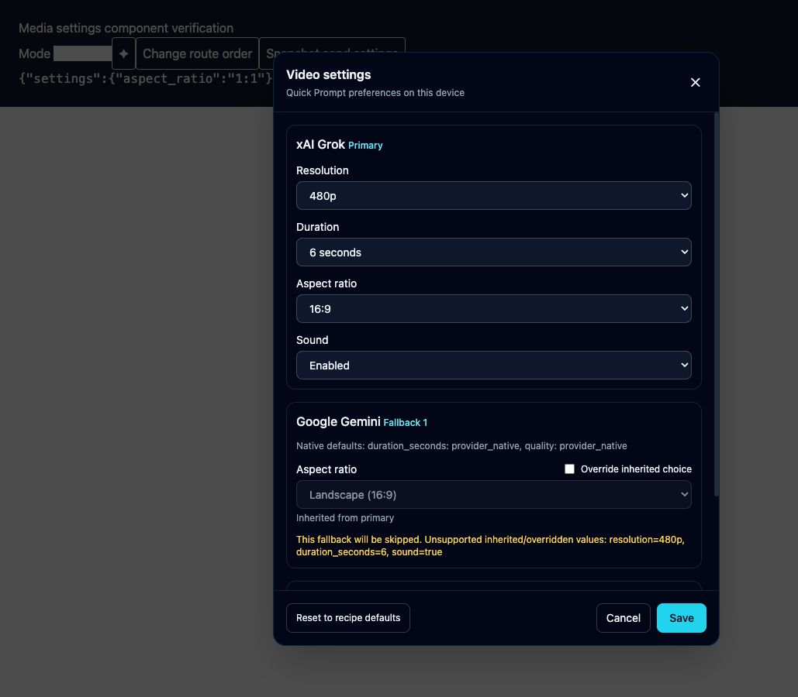

# Recipe-driven media implementation verification

Verified locally on 1 October 2026. The shared implementation, settings UI, HTTP jobs and MCP contracts are implemented. Grok image generation and API artifact capture passed on the free account after the follow-up fix. Gemini Music also passed a separately requested retry, producing a playable MP4 with an audio track.

## Changes

- Declarative activation, settings, positive verification and guarded scoped indexes in recipes. Semantic public values remain separate from internal locators; compact variants inherit selection proof.
- Shared defaults/common settings/provider overrides, model validation, reference uploads, routing and account queues. Settings participate in request identity. A submitted or uncertain media request is never retried through another provider.
- Authenticated capabilities, durable jobs, polling, cancellation and registered-artifact downloads under `/v1/media`. Idempotency keys and metadata persist; interrupted submissions become uncertain instead of replaying. Existing jobs remain recoverable by key when a provider later becomes unavailable.
- Quick Prompt settings dialog with route order, inheritance, override flags, saved device choices, reset, cancellation and send-time snapshots. API and MCP calls do not use desktop preferences.
- Saved images must decode. Audio/video must contain the required tracks and pass the app's isolated, muted playback decoder. MP4 Music remains in Music and requires an audio track. Text-only/empty media replies fail consistently.
- Media execution retains its submitted browser view if opening a drawer replaces the shared adapter's view. Existing gallery and reference URLs are excluded from extraction.

`/v1/chat/completions` retains its existing contract. No application or recipe version bump, commit, release or publication was performed.

## Automated verification

- Complete suite in an isolated copied checkout: **69 test files passed, 3 skipped; 615 tests passed, 11 skipped**.
- `npm run build`: passed. The existing bundle-size warning remains.
- Recipe generated-data consistency and `git diff --check`: passed.
- Coverage includes localized labels, count/order guards, missing/disabled/ambiguous controls, compact selection proof, post-upload rechecks, model dependencies, defaults/override precedence, settings identity, real attachment staging, owner authorization, downloads, idempotency conflicts, cancellation, restart recovery and prevention of duplicate submissions.
- A new regression verifies that desktop choices are captured before asynchronous capability discovery, so subsequent preference edits cannot change a request being sent.
- The final app was restarted after all smoke jobs reached terminal states. Capability discovery returned HTTP 200 with the configured defaults, and the completed ChatGPT test job remained recoverable. Its authenticated registered-artifact download returned HTTP 200 and the expected 2,773,959 PNG bytes.
- Real saved MP4 bytes containing H.264 video and AAC audio passed the native playback validator. This verifies container/audio-track handling; it is not evidence of a newly generated music track.

- Grok follow-up: build, generated recipe consistency and diff checks passed; **59 focused media settings/jobs and ChatGPT/Grok completion tests passed**. Regression coverage includes pointer-driven activation without double clicks and waiting for animated option counts before any selection.

## Live provider verification

Tests were sequential; each result was awaited before beginning another generation. The requested Chrome profiles were used for provider control inspection. No subscription purchase, CAPTCHA bypass or concurrent generation was performed.

| Provider / mode | Result |
| --- | --- |
| Gemini Image | Completed; square setting verified, decodable JPEG saved, 74,710 bytes. Job `4db66b94-e0b4-4062-96a5-44faf887d2f4`. |
| Gemini Video | Completed; landscape setting verified, MP4 saved, 4,163,549 bytes. H.264 1280×720, AAC, 10.005 seconds; native decoder passed. Job `c0296f46-9394-44bd-96e2-3fe3d61a1b80`. |
| Gemini Music | Standard / Custom / Custom applied and positively verified. Gemini returned “Sorry, something went wrong. Please try your request again.” No artifact; job correctly failed with `media_not_generated`. Job `79d147ce-95d6-464f-a141-3ab13a58ef45`. No fallback was submitted. A separately authorized retry completed: job `79661e2b-d994-412d-8918-57a269e28e37`, Standard / Custom / Custom, MP4 saved in `Library/Music`, 14,320,241 bytes, H.264 1024×1024 with stereo AAC 44.1 kHz, duration 180.506 seconds. The native playback validator passed and the full audio stream decoded with FFmpeg without errors. Registered download returned HTTP 200 with SHA-256-identical bytes; unauthenticated access returned HTTP 401. |
| ChatGPT Image with reference | Completed using a newly created two-color synthetic PNG containing no user data. Native image activation and upload passed; decodable PNG saved, 2,773,959 bytes. Job `0170e2f6-f16b-4a8d-9c07-e998a2dc3f47`. |
| Grok Imagine Image | Following explicit user approval, one image request was submitted using the verified `menmersive@gmail.com` account, Speed and 1:1. Earlier setup attempts failed before submission. Grok saved two native image outputs from that one request. One was downloaded through its Library and decoded: JPEG 960×960, 133,878 bytes, matching the sailboat prompt. Transgentic timed out and correctly left job `a73e1974-7532-4626-b9b1-1743704846ed` uncertain; no replay occurred. A separately authorized follow-up request completed end to end after the portal-aware capture fix: job `04bbfdb5-f5bb-4109-a647-27d92ce317b8`, Speed, 1:1, JPEG 960×960, 119,210 bytes. The saved lighthouse image was visually checked against its prompt. Registered artifact `27861e8a-df15-4560-a258-59b0035584df` downloaded with HTTP 200 and SHA-256-identical saved bytes; unauthenticated access returned HTTP 401. Exactly one additional request was submitted. |
| Grok Imagine Video | Controls remain enabled. No video request was submitted because the free account lacks video entitlement. Extraction retains the requested provisional standard MP4 mapping. |

Earlier selector/setup failures occurred before submission. An earlier submitted music request timed out and was marked uncertain; it was not replayed. The later music smoke test used a distinct prompt and produced the explicit provider error above.

Automatic approval review also blocked transferring the Gemini-generated image into ChatGPT without specific payload authorization. The successful ChatGPT upload test used an independently created synthetic fixture instead.

## Control inventory and UI

Gemini Music's compact webview showed both lengths, all three vocal choices and all 18 genres. Standard and Custom selections were applied through the compact controls without submitting a prompt. Desktop provider settings were verified through the sequential HTTP smoke requests. Stable control attributes and scoped indexes select options rather than localized display labels.

The actual settings component was exercised in an isolated UI fixture at narrow and wide viewports, including 480×800 and 1280×900. Verified save/reopen persistence, Cancel discarding changes, Reset removing overrides, route order changes, unsupported inheritance warnings, explicit Grok ratio overrides, scrolling and the full music genre list. Escape returned focus to the settings trigger; native desktop keyboard traversal was also checked. At 380×720, DOM bounds confirmed no horizontal page overflow.

Grok’s live follow-up exposed a new Agent mode beside Image and Video. Mode activation now identifies the inspected icon geometry directly, so the additional mode cannot shift an index. Ratio mapping uses guarded numeric identities instead of obsolete shape styles, and menu triggers use pointer presses. Setup failures remained unsubmitted. Grok’s Library preview also confirms that media can be rendered in a portal outside the main canvas; result extraction now scans recipe-matched media with the existing reference/gallery exclusion guards. Four added regressions cover portal results, unloaded media, reference images and prior assets; The final combined run passed 59 focused settings/jobs/ChatGPT/Grok observer tests. The authorized live follow-up also confirmed completion and registered artifact capture.

## Recipe delivery

- Built-in JSON recipes and generated recipe data updated for Gemini, Grok and ChatGPT.
- Verified identical installed overrides saved to `Recipes/Healed/gemini.json`, `grok.json` and `chatgpt.json` in the user's Transgentic documents folder. These local overrides take priority over bundled defaults; Reset to Default can restore bundled recipe ownership later.

API examples, settings defaults, attachment limits and recovery semantics are documented in [Media API](../MEDIA_API.md).

## Remaining live checks

1. Grok video generation requires a subscription and was not attempted. Its controls remain available with provisional MP4 extraction; image generation and API capture are verified.
